<div align="center">


# 🏠 우심운까 · WoosimWoonkka

### "우리 심심한데 운동이나 할까?"

**공공데이터 기반 운동 장소 추천 및 운동 습관 기록 서비스**

날씨·대기질·거리·운영정보로 **오늘 운동하기 좋은 곳**을 추천하고,<br>
운동 기록으로 **나만의 운동방**을 채워 가는 웹 서비스

[🔗 서비스 바로가기](https://hkjfduhalihufsduahufahoiuw.onrender.com/)

</div>

## 목차

0. [한눈에 보기](#-한눈에-보기)
1. [팀 소개](#1-팀-소개)
2. [프로젝트 개요](#2-프로젝트-개요)
3. [기술 스택](#3-기술-스택)
4. [WBS](#4-wbs)
5. [요구사항 명세서](#5-요구사항-명세서)
6. [ERD](#6-erd)
7. [주요 프로시저](#7-주요-프로시저)
8. [수행결과 (테스트·시연 페이지)](#8-수행결과테스트시연-페이지)
9. [한 줄 회고](#9-한-줄-회고)
10. [용어 사전](#-용어-사전)

---

## 👀 한눈에 보기

우심운까는 **"어디서 운동하지?"** 라는 고민을 데이터로 풀어 주고, **"운동을 계속할 이유"** 를 게임처럼 만들어 주는 서비스입니다.

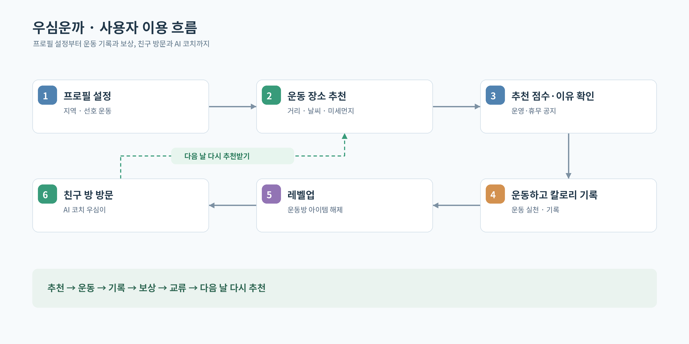

| 질문 | 답 |
|---|---|
| 무엇을 하나요? | 오늘의 날씨·미세먼지·거리를 따져 운동 장소를 점수로 추천하고, 운동 기록을 레벨과 방 꾸미기 보상으로 바꿔 줍니다. |
| 데이터는 어디서 오나요? | 공공데이터포털(체육시설·기상청·에어코리아 등), 문화빅데이터 플랫폼, 카카오 지도, 시설 공개 홈페이지 |
| DB에는 데이터가 얼마나 있나요? | README에 기록한 Supabase 조회 스냅샷 기준, 39개 `m3_*` 테이블에 **4,994,780행**이 있습니다. 원본·정제·파생·모니터링 테이블을 합한 물리 행 수이며 고유 데이터 건수는 아닙니다. |
| 추천은 AI가 하나요? | 아니요. **팀이 정한 규칙으로 점수를 계산**합니다. (예: 비가 오면 실내 시설 +8점) AI는 대화형 코치 '우심이'에만 쓰입니다. |
| 누가 만들었나요? | TEAM MOTIVE 4명 (프론트엔드 2 · 데이터 1 · 백엔드 1) |

---

## 1. 팀 소개

### 팀명: **MOTIVE**

> 운동을 **시작할 이유(Motive)** 와 **이어갈 재미**를 함께 만드는 팀

|  |  |  |  |
| :---: | :---: | :---: | :---: |
| **신경호** | **류지예** | **백선영** | **김형준** |
| 프론트엔드 · 발표자료 | 프론트엔드 · 발표자료 | 서비스 기획 · 데이터 엔지니어링 | 백엔드 · 프로젝트 전반 |
| [@Shinkyeongho](https://github.com/Shinkyeongho) | [@callijee22-ship-it](https://github.com/callijee22-ship-it) | [@baikAnalyst](https://github.com/baikAnalyst) | [@kimhyounjun](https://github.com/kimhyounjun) |

| 팀원 | 역할 | 담당 업무 |
|---|---|---|
| **신경호** | 프론트엔드 · 발표자료 | 서비스 화면 구현, 사용자 인터페이스 구성, 발표자료 준비 |
| **류지예** | 프론트엔드 · 발표자료 | 서비스 화면 구현, 사용자 경험 구성, 발표자료 준비 |
| **백선영** | 서비스 기획 · 데이터 엔지니어링 | 서비스 기획, 공공데이터 조사·선정, 데이터 수집·정제·품질검증, Supabase(PostgreSQL) 데이터 파이프라인 구축, 스케줄링·모니터링·알림 자동화 |
| **김형준** | 백엔드 · 프로젝트 전반 | Django 백엔드, 기능 연동, 배포 설정 및 프로젝트 전반 |

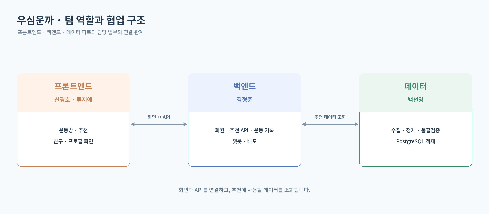

---

## 2. 프로젝트 개요

### 2-1. 프로젝트명

**우심운까: 공공데이터 기반 운동 장소 추천 및 운동 습관 기록 서비스**

### 2-2. 프로젝트 소개 — "여러분의 미니홈피는 어떤 모습이었나요?"

우심운까는 **싸이월드의 미니룸과 친구 방문**에서 착안한 운동 서비스입니다.
할 일이 없어도 자꾸 들어가 보고 싶었던 '나만의 공간'의 재미를 **운동**과 연결했습니다.

- 사용자는 자신의 **운동 지역과 선호 운동**을 설정하고, **날씨·대기질·거리·운영정보**를 반영한 운동 장소를 추천받습니다.
- 운동 후에는 **칼로리를 기록**하고, 누적 운동량에 따라 **레벨업과 운동방 아이템 보상**을 받습니다.
- **친구 운동방 방문**과 **AI 운동 코치 '우심이'** 를 통해 운동을 계속 이어갈 수 있습니다.

| 🏠 나만의 운동방 | 🏃 오늘의 운동 장소 추천 | 🎁 운동 기록과 보상 | 👋 친구 방문 | 🤖 AI 코치 우심이 |
|---|---|---|---|---|
| 캐릭터와 가구를 드래그해 꾸미는 미니룸 | 지역·종목·이동시간 + 날씨·미세먼지로 오늘 갈 곳 추천 | 칼로리를 기록하면 레벨이 오르고 소품·스킨이 열림 | 친구 코드로 친구를 맺고 친구 방에 한마디 | 내 기록과 추천 결과를 바탕으로 운동 상담 |

```text
프로필 설정
→ 운동 장소 추천
→ 추천 점수·환경정보 확인
→ 운동 기록
→ 레벨업·운동방 꾸미기
→ 친구 방문·AI 코치 활용
```

> **다시 찾아오고 싶은 공간을 만들고 싶었습니다.**

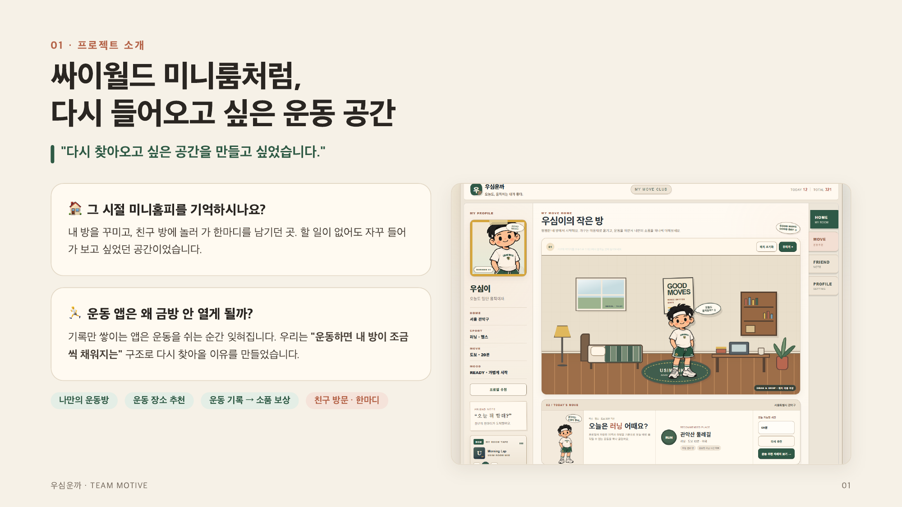

### 2-3. 프로젝트 필요성(배경) — "그런데 운동하려고 하면 이런 생각이 들죠."

<div align="center">

**"오늘 비 오는데?"**   **"미세먼지 심하다던데?"**   **"근처에 어디로 가야 할지 모르겠는데?"**

</div>

운동을 시작하려고 하면 주변 시설, 날씨, 대기질, 이동시간, 운영 여부를 **각각 다른 앱에서 따로** 확인해야 합니다.
사용자가 운동을 미루는 대표적인 이유와, 이를 해결하기 위해 우리가 연결한 데이터는 다음과 같습니다.

| 운동을 미루는 이유 | 필요한 데이터 | 출처 | 서비스에서 하는 일 |
|---|---|---|---|
| 오늘 비가 오는지 알기 어려움 | 강수·기온·습도·풍속 | 기상청 초단기실황 | 실내·실외 시설 점수 조정 |
| 미세먼지가 심한지 알기 어려움 | PM10 · PM2.5 | 에어코리아 | 대기질이 나쁘면 실내 시설에 가점 |
| 주변에 어떤 시설이 있는지 모름 | 시설명·유형·주소·좌표 | 전국체육시설 API, 카카오 로컬 | 가까운 시설 후보 추천 |
| 이동시간이 얼마나 걸리는지 모름 | 거리, 사용자가 정한 최대 이동시간 | 좌표 계산 + 사용자 입력 | 이동시간 초과 시설 제외 |
| 시설이 운영 중인지 알기 어려움 | 공개 운영·휴무 안내 | 시설 공개 홈페이지 (크롤링) | 휴무 공지 확인, 감점 |
| 기록·보상이 없어 지속하기 어려움 | 운동 칼로리 기록 | 사용자 입력 | 레벨업, 운동방 보상, 친구 교류 |

> ⏱️ **이동시간 계산 방식** — 이동시간은 별도의 공공데이터가 아닙니다. 현재는 `거리(km) × 20분`의 도보 기준 추정치로, 실제 길찾기 시간과는 다를 수 있습니다.

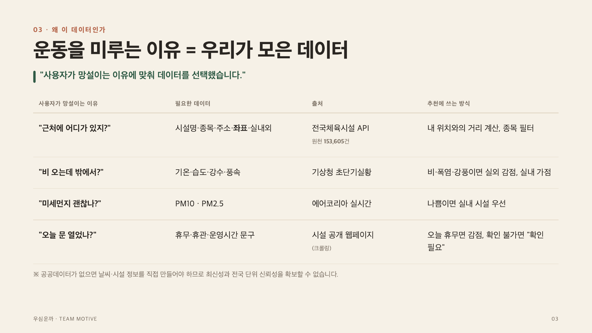

따라서 시설 위치뿐 아니라 **환경정보와 운영정보를 함께 수집**하고, 추천 결과에 반영했습니다.
또한 이 정보들은 출처마다 형식이 다르고 계속 바뀌기 때문에, 사람이 손으로 모으지 않도록 **원본 보존 → 정제 → 품질검증 → 적재**를 반복하는 **데이터 파이프라인**을 함께 만들었습니다.

### 2-4. 공공데이터 활용 필요성

운동 장소를 제대로 추천하려면 "시설이 어디 있는지"뿐 아니라 "지금 가도 괜찮은지"를 알아야 합니다.
이 정보는 한 곳에 모여 있지 않아 **여러 공공데이터를 하나로 연결**해야 했습니다.

> **표 읽는 법** — ✅ 추천 결과에 직접 사용 · 🛡️ 추천 상세의 안전정보로 사용 · 🤖 AI 운동 코치가 조건 검색에 사용 · 🗂️ 수집·정제·적재 완료(현재 서비스 직접 조회는 제한적) · 🚫 현재 서비스에서 사용하지 않음
> 적재 건수는 [8-1. 데이터 처리 결과](#8-1-데이터-처리-결과)의 PROCESSED 적재 기준입니다.

#### 공공데이터포털 데이터

| 데이터 | 활용 내용 | 적재 건수 | 상태 |
|---|---|---:|:---:|
| 국민체육진흥공단 전국체육시설 정보 | 시설명·유형·주소·좌표를 이용한 시설 후보 및 거리 계산 | 106,521 | ✅ |
| 기상청 단기예보·초단기실황 | 기온(T1H)·습도(REH)·강수(PTY·RN1)·풍속(WSD)으로 실내·실외 점수 보정 | 222 | ✅ |
| 한국환경공단 에어코리아 | PM10·PM2.5로 대기질 판단 | 1,402 | ✅ |
| 공공체육시설 운영정보 | 운영정보 참고용으로 적재하고, 추천 시점에는 공개 홈페이지 크롤링으로 최신 공지를 보완 | 7,331 | 🗂️ |
| 기상특보 | 호우·폭염 등 위험 상황 안내 | 128 | 🗂️ |
| 공공시설개방 정보 | 이용 가능한 공공 체육시설 보강 | – | 🗂️ |
| AED 정보 | 추천 상세 보기에서 AED 설치 여부·위치를 표시 | 63,626 | 🛡️ |
| 두루누비 구간·경로 | 걷기·자전거 운동 후보 경로 보강 | 143 | 🗂️ |
| 자전거 사고다발지역 | 자전거 운동 시 안전 참고정보 | 5,046 | 🗂️ |

#### 문화빅데이터 플랫폼 데이터

| 데이터 | 활용 내용 | 적재 건수 | 상태 |
|---|---|---:|:---:|
| 전국공공체육시설 데이터 | 공공 체육시설 위치·유형 참고 및 적재 | 42,879 | 🗂️ |
| 공공체육시설 프로그램 정보 | 시설별 운동 종목·프로그램 참고 및 적재 | 401,865 | 🗂️ |
| 체육시설 안전점검 정보 | 추천 상세 보기에서 안전점검 결과·일자를 표시 | 182,365 | 🛡️ |
| 전국체육시설 현황 데이터 | 시설명·주소·좌표·시설 유형 참고 및 적재 | 140,224 | 🗂️ |
| 학교개방 체육시설 | 개방 체육시설 참고 및 적재 | 1,206 | 🗂️ |
| 위치기반 체력측정 및 운동처방 정보 | AI 코치가 질문의 운동 키워드와 지역 조건으로 처방 후보를 검색·집계 (연령·측정값은 결과 근거로 전달) | 1,389,228 | 🤖 |
| 체력 측정별 운동처방 데이터 | AI 코치가 질문의 운동 키워드로 처방 후보를 검색·집계 (연령·성별은 검색 필터로 쓰지 않음) | 25,070 | 🤖 |

#### 그 밖의 외부 서비스

| 서비스 | 활용 내용 | 상태 |
|---|---|:---:|
| 카카오 로컬 API | 주소 → 좌표 변환, 좌표 → 행정구역 변환, DB에 시설이 없을 때 장소 검색으로 보완, 시설 공개 페이지 찾기 | ✅ |
| 시설 공개 홈페이지 | 운영시간·휴무·휴관 문구 확인 (크롤링) | ✅ |
| OpenAI API | AI 운동 코치 '우심이' 답변 생성 | ✅ |

#### 데이터 활용 구조

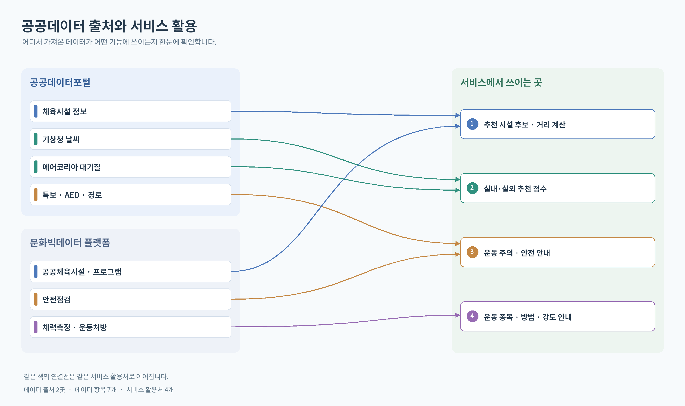

### 2-5. 프로젝트 목표 — "내 방을 꾸미듯, 내 운동 습관도 키울 수 없을까?"

**목표: 운동을 시작할 때의 망설임은 줄이고, 운동을 이어 갈 재미를 만들어 꾸준한 운동을 돕는다.**

| 목표 | 구현 내용 |
|---|---|
| 프로필 기반 추천 | 프로필에 저장된 지역과 선호 운동을 기준으로 장소 추천 |
| 환경 반영 점수 | 거리·날씨·대기질을 반영한 추천 점수와 추천 이유 제공 |
| 헛걸음 방지 | 추천 시점에 운영·휴무 정보 확인 |
| 믿을 수 있는 데이터 | 공공데이터와 문화빅데이터 수집·정제·품질검증 |
| 데이터 관리 | Supabase 데이터베이스에서 원본(RAW)·정제(PROCESSED) 데이터 분리 |
| 지속의 재미 | 운동 칼로리 기록과 레벨업, 운동방 꾸미기와 친구 방문 |
| 대화형 도움 | AI 운동 코치 '우심이' 제공 |

> **운동을 시작할 때의 망설임을 줄이고, 이어갈 재미를 제공합니다.**

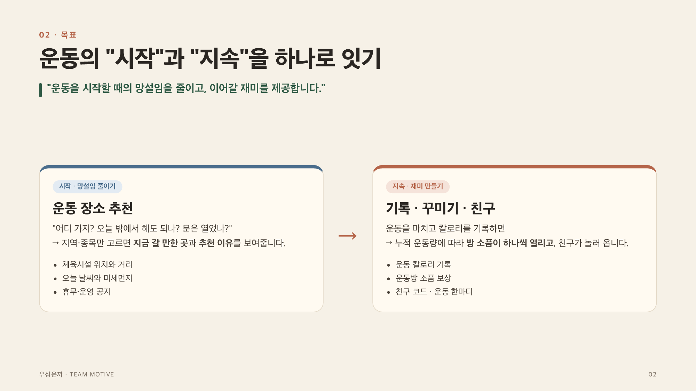

---

## 3. 기술 스택

<div align="center">

| 분류 | 기술 |
| :---: | :--- |
| **Frontend** |    |
| **Backend** |   |
| **Database** | **Supabase** ·   |
| **Collaboration** |   |

</div>

> 데이터베이스 서비스는 **Supabase**를 사용합니다. Supabase의 관리형 **PostgreSQL**이 데이터를 저장하고, **PostGIS**는 위치·거리 계산에 사용하는 PostgreSQL 확장입니다. 문서의 PostgreSQL 표기는 DB 서비스 제공자가 아니라 기반 엔진을 뜻합니다.

| 구분 | 기술 | 사용 목적 | 🙋 쉽게 말하면 |
|---|---|---|---|
| Frontend | HTML, CSS, JavaScript, Django Template | 운동방·추천·프로필·친구 화면 | 사용자가 **눈으로 보고 누르는 화면** |
| Backend | Python, Django | 회원·추천·운동 기록·친구 API | 화면 뒤에서 **요청을 받아 계산하고 저장하는 두뇌** |
| Database | **Supabase** (관리형 PostgreSQL, PostGIS 확장) | 회원·시설·위치·운동 데이터 | Supabase는 관리형 **창고 서비스**, PostgreSQL은 저장 엔진, PostGIS는 "여기서 몇 km?"를 계산하는 **지도 기능** |
| Data Collection | requests, BeautifulSoup4 | API 및 운영정보 수집 | 공공데이터를 **받아 오고**, 홈페이지 글자를 **읽어 오는** 도구 |
| Coordinate | pyproj, Supabase PostgreSQL의 PostGIS | 좌표 변환 및 거리 계산 | 서로 다른 좌표 형식을 **하나로 맞추고**, DB에서 위치 간 거리를 계산하는 도구 |
| AI | OpenAI API | AI 운동 코치 | '우심이'의 **대화 능력** |
| External API | 기상청·에어코리아·카카오 | 날씨·대기질·주소·장소 검색 | 다른 기관이 제공하는 **정보 창구** |
| Deployment | Gunicorn, WhiteNoise, Render | 서비스 배포 | 누구나 인터넷으로 접속할 수 있게 **서버에 올리는** 도구 |
| Collaboration | GitHub, Notion, Discord | 협업·문서·알림 | 코드 공유 · 문서 정리 · 팀 대화 |

> 💡 **추천 로직은 학습 모델이 아닌 규칙 기반 점수 계산 방식입니다.**
> "AI가 알아서 골라준다"가 아니라, 팀이 정한 기준(거리·날씨·미세먼지)에 따라 **점수를 더하고 빼서** 순위를 매깁니다. 그래서 왜 이 시설이 1등인지 **이유를 항상 설명할 수 있습니다.**

### 시스템 구조 — 한 번의 추천 요청은 이렇게 흘러갑니다

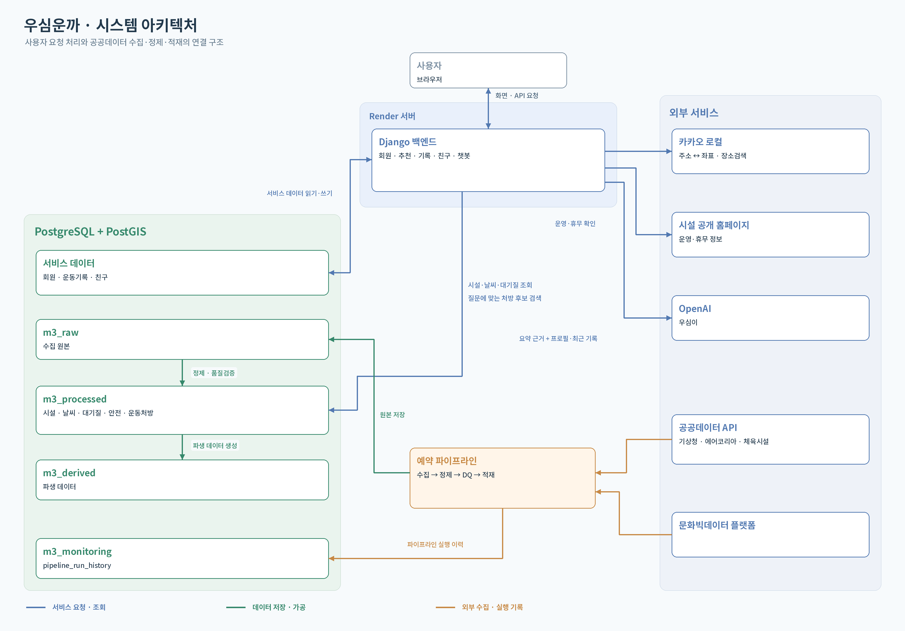

> 아키텍처 그림의 `PostgreSQL + PostGIS`는 **Supabase가 제공하는 데이터베이스 엔진과 확장 기능**을 가리킵니다. 별도의 PostgreSQL 호스팅 서비스를 사용한다는 뜻은 아닙니다.

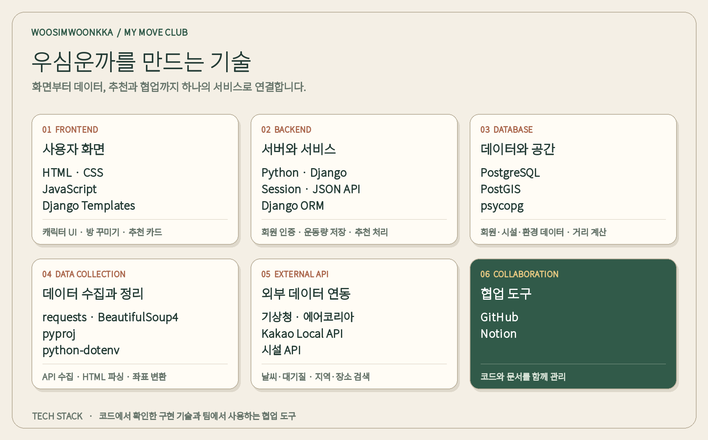

> 정기 파이프라인은 원본과 정제 데이터를 분리해 적재합니다. 추천 요청은 정제 데이터와 규칙 기반 점수를 사용하고, 운영 공지는 요청 시 크롤링합니다. AI 코치는 질문 의도에 따라 운동처방 테이블에서 일부 근거를 조회해 답변을 생성하며 대량 원본 전체를 AI에 전달하지 않습니다.

---

## 4. WBS

> **WBS(Work Breakdown Structure)** — 큰 프로젝트를 "누가, 무엇을, 어떤 결과물로" 할지 작은 작업 단위로 쪼갠 표입니다.

| 단계 | 작업 | 산출물 | 담당 |
|:---:|---|---|---|
| 1 | 서비스 기획 및 요구사항 정의 | 요구사항 명세서 | 전원 |
| 2 | 공공데이터 조사·선정 | 데이터 목록·활용 목적 | 백선영 |
| 3 | 데이터 수집 | API 원본 JSON·CSV | 백선영 |
| 4 | 데이터 전처리·표준화 | 정제 데이터 | 백선영 |
| 5 | 품질검증 | DQ 결과·오류 로그 | 백선영 |
| 6 | Supabase 데이터베이스 구축 | 테이블·데이터 적재 결과 (PostgreSQL 기반) | 백선영·김형준 |
| 7 | 추천 백엔드 구현 | 추천 API·점수 계산 | 김형준 |
| 8 | 프론트엔드 구현 | 운동방·추천·친구 화면 | 신경호·류지예 |
| 9 | 운동 기록·레벨 구현 | 칼로리·레벨·보상 기능 | 김형준 |
| 10 | AI 챗봇 구현 | 우심이 챗봇 | 김형준·프론트엔드 |
| 11 | 테스트·배포 | 테스트 결과·배포 서비스 | 전원 |

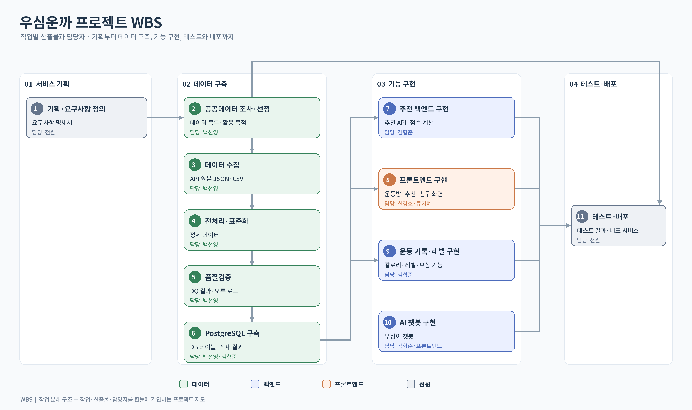

<sub>🟩 데이터 · 🟦 백엔드 · 🟧 프론트엔드 · ⬜ 전원</sub>

---

## 5. 요구사항 명세서

> **요구사항 명세서** — "이 서비스는 무엇을 할 수 있어야 하는가"를 약속처럼 적어 둔 목록입니다.
> **사용자 요구사항**은 사용자가 직접 쓰는 기능, **시스템 요구사항**은 눈에 보이지 않지만 서비스가 지켜야 할 기준입니다.

### 5-1. 사용자 요구사항

| ID | 요구사항 | 구현 위치 (화면 / API) |
|---|---|---|
| UR-01 | 회원가입·로그인 (게스트 체험 포함) | 회원가입·로그인 화면, `guest/start/` |
| UR-02 | 기본 운동 지역과 선호 운동 저장 | PROFILE 화면 |
| UR-03 | 운동 장소 추천 | MOVE 화면, `GET /api/live-recommendations/` |
| UR-04 | 거리·날씨·대기질 확인 | 추천 결과 카드 |
| UR-05 | 추천 점수와 추천 이유 확인 | 추천 결과 카드 |
| UR-06 | 운동 칼로리 기록 | 운동방·RECORD 화면, `POST /api/workout-calories/` |
| UR-07 | 레벨·경험치 확인 | 운동방 레벨 바 |
| UR-08 | 레벨 초기화 및 최근 기록 되돌리기 | `/api/workout-calories/reset/`, `/undo/` |
| UR-09 | 운동방 꾸미기 | 운동방 꾸미기 패널, `/api/room-state/` |
| UR-10 | 캐릭터 선택 | 캐릭터 스킨 · 펫(용) 선택, `/api/dragon-character/` |
| UR-11 | 친구 추가·방문·운동 한마디 | FRIENDS 화면, `/api/friends/…`, `/api/friend-notes/…` |
| UR-12 | AI 운동 코치 사용 | 챗봇 창, `POST /api/chatbot/` |

### 5-2. 시스템 요구사항

| ID | 요구사항 | 어떻게 지키나요? |
|---|---|---|
| SR-01 | 시설·날씨·대기질 데이터 수집 | 공공데이터 API 수집 스크립트 (`collector.py`) |
| SR-02 | 원본·정제 데이터 분리 | RAW 저장 후 PROCESSED 스키마에 정제본 적재 |
| SR-03 | 결측·중복·좌표·자료형 검증 | 필수값·중복(시설명+주소)·위경도 범위·숫자형 검사 |
| SR-04 | 추천 점수 내림차순 정렬 | 점수 높은 순, 동점이면 가까운 순 |
| SR-05 | 수집 작업 오류 기록·복구 | 수집기별 재시도 정책 적용, 최종 실패는 실행 이력에 기록 |
| SR-06 | 운영정보 확인 실패 시 `확인 필요` 표시 | 크롤링 실패해도 시설은 유지하고 상태만 표시 |
| SR-07 | API 키와 DB 정보를 환경변수로 관리 | `.env` / Render 환경변수, 저장소에 커밋하지 않음 |
| SR-08 | 챗봇 API 키를 서버에서만 관리 | 브라우저는 Django 서버하고만 통신, 키는 서버에만 존재 |
| SR-09 | 운동 기록 입력값 검증 | 1kcal 미만·숫자 아님 → 거부, 게스트는 저장 불가 |
| SR-10 | 실행 로그와 오류 기록 | 단계별 건수·상태·오류를 로그로 기록 |
| SR-11 | 비밀번호 보호 | 원문이 아닌 **해시(암호화된 값)** 로만 저장 |
| SR-12 | 크롤링 예절 준수 | `robots.txt`에서 허용된 페이지만 접근 |

---

## 6. ERD

> **ERD(Entity Relationship Diagram)** — 데이터베이스에 어떤 표(테이블)가 있고, 표끼리 어떻게 연결되는지 그린 그림입니다.
> 예를 들어 "회원 1명은 운동기록 1개를 가진다", "회원 1명은 친구를 여러 명 가질 수 있다" 같은 관계를 나타냅니다.

### 6-1. 주요 테이블

| 테이블 | 쉽게 말하면 | 주요 정보 |
|---|---|---|
| `Member` | 회원 카드 | 이름·닉네임·비밀번호 해시·주소·**친구 코드(USIM-XXXXXX)**·방 꾸미기 상태 |
| `WorkoutProgress` | 운동 통장 | 누적 칼로리, 최근 운동 기록(최대 30건) → 레벨 자동 계산 |
| `Friendship` | 친구 목록 | 누가 누구와 친구인지 (양방향 저장) |
| `FriendRequest` | 친구 신청서 | 요청자·수신자·상태(대기/승인/거절) |
| `FriendNote` | 운동 한마디 | 작성자·내용(최대 60자) |
| `SiteVisit` | 방문 도장 | 하루 한 번 방문 기록 (방문자 수 집계) |
| `Profile` | 추천용 프로필 | 닉네임·연령대·도시 (기존 추천 기능 호환) |

### 6-2. 관계도

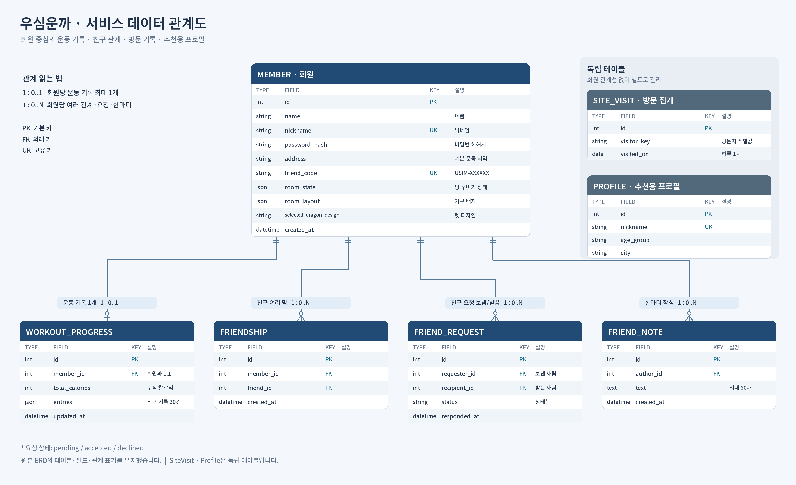

### 6-3. 추천에 쓰이는 데이터 테이블

운영 데이터베이스 서비스는 **Supabase**이며, 저장 엔진은 PostgreSQL입니다. Supabase PostgreSQL의 별도 스키마에서 수집 원본은 `m3_raw`, 정제 데이터는 `m3_processed`, 파생 결과는 `m3_derived`, 실행 이력은 `m3_monitoring`에 저장합니다. 추천·AI 코치는 정제 테이블을 조회하고, 원본 데이터는 재처리와 장애 분석을 위해 보존합니다.

**운동 장소 추천**

- `m3_processed.facility` — 시설명·유형·지역·주소·좌표로 후보를 조회하고, 지역·운동 종목을 필터링해 거리 점수를 계산합니다.
- `m3_processed.weather_ultra_ncst` — 격자(nx, ny)와 기온(T1H)·습도(REH)·강수(PTY·RN1)·풍속(WSD)를 이용해 실내·실외 추천 점수를 보정합니다.
- `m3_processed.air_quality` — 측정소의 PM10·PM2.5·오존·통합대기지수로 대기질 점수를 보정합니다.

**추천 상세 안전정보**

- `m3_processed.aed` — 설치 주소와 상세 위치를 추천 상세 화면에 표시합니다.
- `m3_processed.culture_sports_facility_safety_inspections` — 시설의 안전점검 결과와 점검일을 표시합니다.
- `m3_processed.public_open_facility` — 공공시설 운영·개방 참고 데이터를 보관합니다. 추천 시점의 운영 공지 확인은 공개 홈페이지 크롤링으로 별도 보완합니다.

**AI 운동 코치**

- `m3_processed.culture_fitness_measurement_prescriptions` — 처방 문구 키워드로 검색합니다. 연령대·성별·측정 장소는 조회 결과에 포함된 자료입니다.
- `m3_processed.culture_location_fitness_measurement_prescriptions` — 처방 문구 키워드와 프로필 지역(있을 때)으로 검색합니다. 연령대·체력 측정값·측정센터는 조회 결과의 근거 정보입니다.

**분석·운영 기록**

- `m3_derived.facility_recommendation` — 시설 추천용 파생 결과를 보관합니다. 현재 추천 요청은 최신 조건으로 점수를 다시 계산합니다.
- `m3_monitoring.pipeline_run_history` — `run_id`, 단계별 처리 건수, 상태와 오류를 기록해 파이프라인·DQ 실행을 모니터링합니다.

Supabase DB 전체 적재 현황은 다음과 같습니다. 행 수는 README에 기록된 테이블별 `COUNT(*)` 조회 스냅샷이며, 실시간 값이 아닙니다.

| 스키마 | 테이블 수 | 스냅샷 행 수 합계 |
|---|---:|---:|
| `m3_raw` | 19 | 2,511,493 |
| `m3_processed` | 18 | 2,369,349 |
| `m3_derived` | 1 | 113,852 |
| `m3_monitoring` | 1 | 86 |
| **합계** | **39** | **4,994,780** |

> `m3_raw`와 `m3_processed`는 같은 원천 데이터의 수집본·정제본을 각각 보관할 수 있습니다. 따라서 전체 행 수 합계는 테이블에 저장된 행의 합이며, 중복을 제거한 고유 데이터 수가 아닙니다. 실제 사용자 흐름에서 직접 조회하는 것은 시설·날씨·대기질, AED·안전점검, AI 운동처방 데이터입니다.

---

## 7. 주요 프로시저

> **프로시저** — 서비스 안에서 일이 처리되는 **순서**입니다. 요리 레시피처럼 "무엇을 먼저 하고 다음에 무엇을 하는지"를 정리했습니다.

### 7-1. 추천 점수 계산

#### 추천은 이런 순서로 만들어집니다

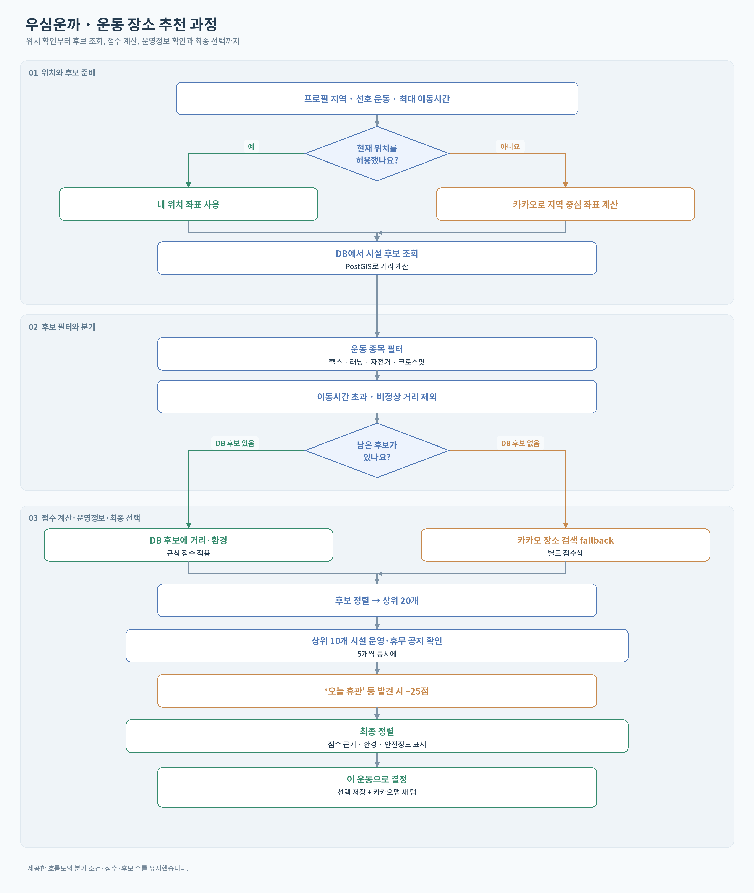

#### 점수 공식

```text
기본 점수 (45)
+ 거리 점수 (최대 40)
+ 날씨·대기질 보정
- 운영정보 감점
= 최종 추천 점수 (0 ~ 99점)
```

| 조건 | 점수 | 이유 |
|---|---:|---|
| 기본 점수 | 45 | 모든 후보의 출발점 |
| 거리 | `40 − 거리(km) × 18` (최소 0) | 가까울수록 높음 (1km → +22, 2km → +4) |
| 비 · 실내 시설 | **+8** | 비 오는 날엔 실내가 좋음 |
| 비 · 실외 시설 | **−24** | 비 오는 날 야외 운동은 어려움 |
| 실외 · 기온 10~25℃ | +6 | 야외 운동하기 좋은 날씨 |
| 실외 · 기온 5℃ 미만 또는 30℃ 초과 | −10 | 너무 춥거나 더움 |
| 실외 · 습도 40~70% | +4 | 쾌적함 |
| 실외 · 습도 80% 이상 | −8 | 너무 습함 |
| 실외 · 풍속 8m/s 이상 | −8 | 바람이 강함 |
| 미세먼지 나쁨 (PM10 ≥ 81 또는 PM2.5 ≥ 36) · 실내 | **+14** | 공기가 나쁘면 실내로 |
| 대기질 양호 · 실외 | +5 | 밖에서 운동해도 괜찮음 |
| 운영 공지에 "오늘 휴무 · 금일 휴무 · 오늘 휴관 · 임시 휴관" | **−25** | 헛걸음 방지 |

#### 같은 거리, 다른 날씨 — 계산 예시

두 시설 모두 **1km** 거리이고, **비가 오고 미세먼지가 나쁜** 날이라고 가정합니다.

| 항목 | 🏋️ 실내 헬스장 | 🏞️ 공원 운동장 |
|---|---:|---:|
| 기본 점수 | 45 | 45 |
| 거리 점수 (40 − 1 × 18) | +22 | +22 |
| 비 보정 | +8 | −24 |
| 미세먼지 나쁨 → 실내 가점 | +14 | 0 |
| **합계** | **89점** 🥇 | **43점** |

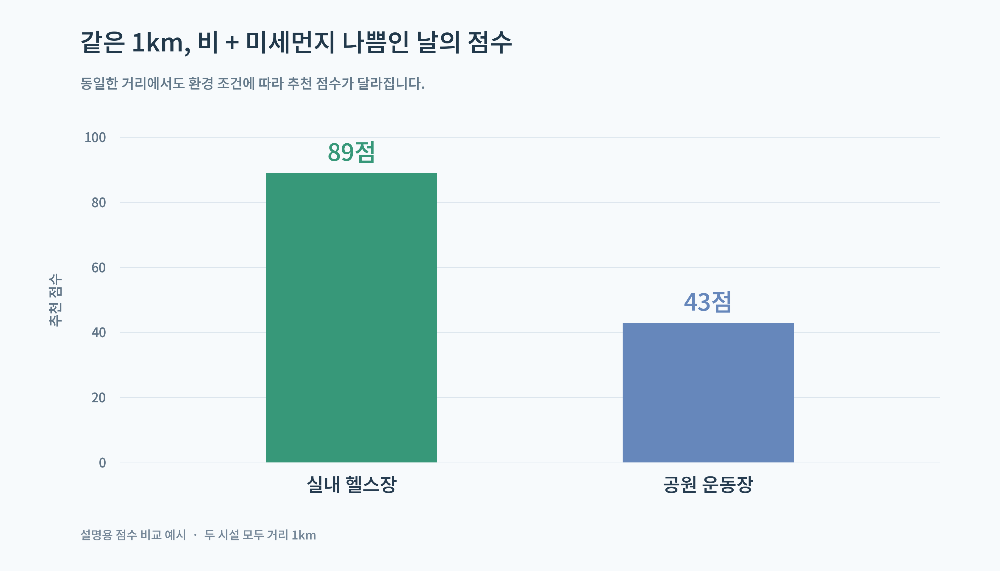

> 거리 점수는 시설과 출발 좌표 사이의 **직선거리** 기반입니다. 화면의 `거리 × 20분`은 이동시간 필터에 쓰는 단순 추정치이며, 실제 길찾기 소요시간과 다를 수 있습니다.
>
> **같은 거리여도, 오늘의 환경에 맞는 장소를 먼저 보여줍니다.**
> 추천 카드에는 "비가 와서 실내 시설 우선", "미세먼지가 높아 실내 시설 우선" 처럼 **점수가 바뀐 이유**가 함께 표시됩니다.

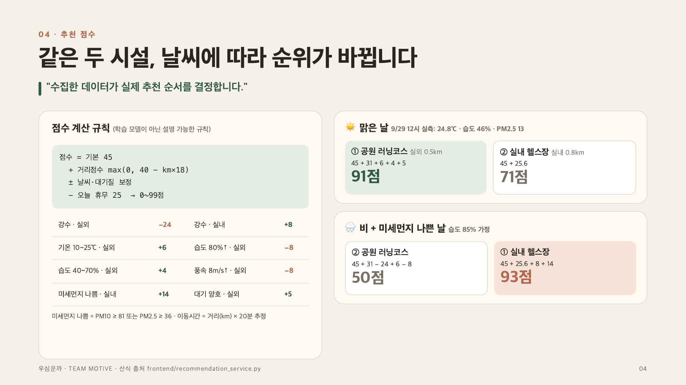

<sub>코드: [`frontend/recommendation_service.py`](frontend/recommendation_service.py) · `make_recommendations`</sub>

### 7-2. 데이터 파이프라인

> **데이터 파이프라인** — 수도관을 따라 물이 흐르듯, 데이터가 여러 처리 단계를 거쳐 흐르는 구조입니다. 이 프로젝트에서는 수집 → 원천 데이터 적재 → 정제·품질검사(DQ) → 정제 데이터 적재 과정을 자동화했습니다.

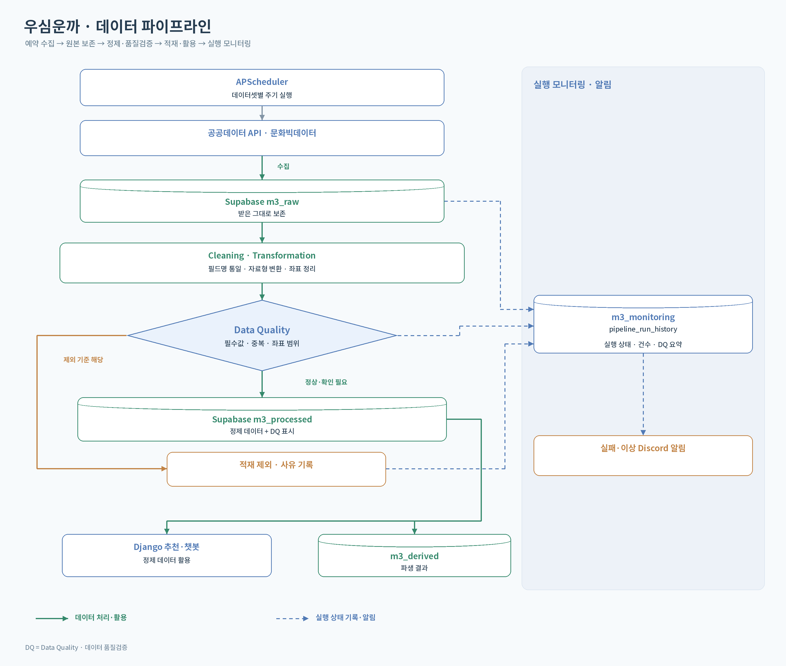

| 단계 | 하는 일 | 예시 |
|---|---|---|
| 수집 | 시설·기상·대기질 API 호출 | API별 오류·재시도 정책을 적용하고 최종 상태를 기록 |
| 원본 보존 (RAW) | 받은 응답을 손대지 않고 저장 | 나중에 "원래 값이 뭐였지?"를 확인할 수 있음 |
| 정제 (Cleaning) | 제각각인 필드를 표준 컬럼으로 통일 | `faci_nm` → `facility_name`, 문자열 좌표 → 숫자 |
| 품질검증 (DQ) | 필수값 누락·중복·좌표 범위 검사 | 좌표 (0, 0)·범위 밖 값은 통과시키지 않음 |
| 적재 (PROCESSED) | 정상 데이터와 품질 확인 필요 데이터를 구분해 저장 | 제외 기준에 해당한 행은 적재하지 않고, 확인 필요 행은 표시를 남겨 보존 |
| 로그 | 실행 번호·건수·상태·오류 기록 | 어느 단계에서 몇 건이 빠졌는지 추적 |

정기 파이프라인은 데이터셋별 주기로 수집·정제·DQ·적재를 수행합니다. 실행 이력은 `m3_monitoring.pipeline_run_history`와 로그에 남기고, 실패·이상은 Discord로 알립니다. 추천 시점의 운영·휴무 공지는 배치 적재와 별개로 크롤링하며 해당 요청의 후보 재정렬에만 반영합니다.

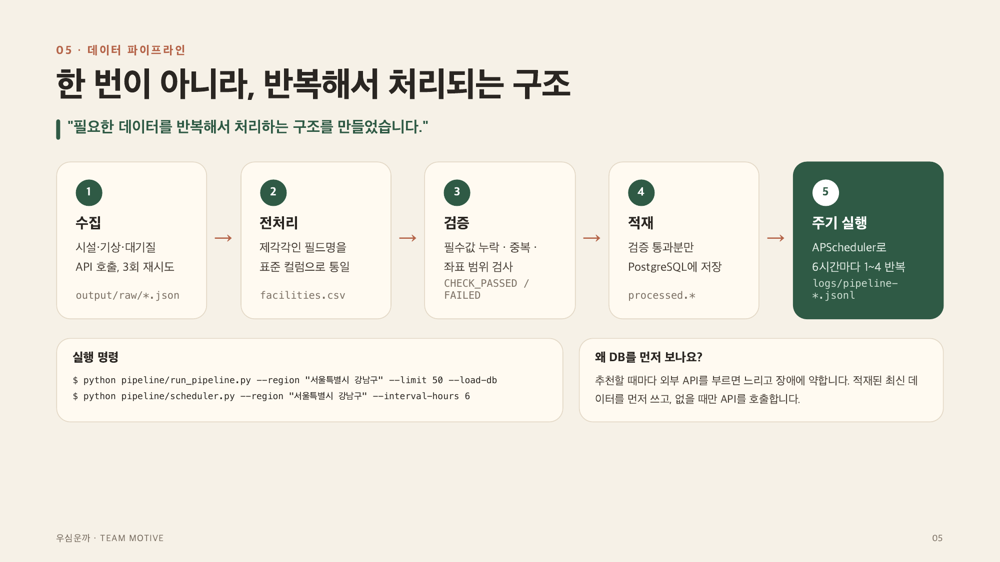

#### 정기 적재와 추천 시점 크롤링은 별도 작업입니다

| 처리 | 실행 시점 | 저장·활용 |
|---|---|---|
| 공공·문화 데이터 파이프라인 | 데이터셋별 스케줄 | `m3_raw` → 정제·DQ → `m3_processed`; 이력은 `m3_monitoring` |
| 시설 운영 공지 크롤링 | 사용자가 추천을 요청할 때 | 공개 페이지 문구를 해당 요청에만 반영해 후보 재정렬 |

### 7-3. 크롤링 (운영·휴무 정보 확인)

> **크롤링** — 사람이 웹페이지를 열어 읽듯, 프로그램이 공개된 웹페이지의 글자를 자동으로 읽어 오는 것입니다.

시설 기본정보만으로는 추천 시점의 **휴무·휴관·임시 운영중단** 여부를 알기 어렵습니다. "오늘 임시 휴관" 같은 최신 공지는 공공데이터에 없기 때문입니다.
그래서 **사용자가 추천을 요청하는 순간**, 상위 후보 시설의 공개 홈페이지에서 다음 문구를 찾습니다.

`휴관` · `휴무` · `운영시간` · `공사` · `점검` · `임시` · `이용 제한` · `폐관` · `예약`

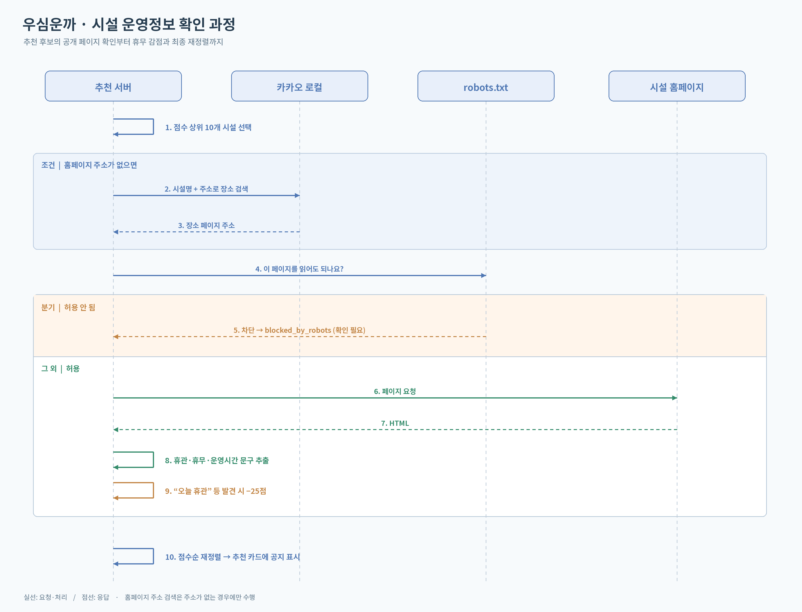

| 결과 상태 | 의미 | 화면 표시 |
|---|---|---|
| `ok` | 공지 문구를 찾음 | 추천 카드에 운영 공지 표시 |
| `no_homepage` / `no_public_page` | 공개 페이지가 없음 | 확인 필요 |
| `blocked_by_robots` | 사이트가 자동 접근을 허용하지 않음 | 접근하지 않고 확인 필요 |
| `request_failed` / `crawl_failed` | 페이지 요청 실패 | 시설은 유지, 확인 필요 |

> - 5개 시설을 **동시에** 확인해 기다리는 시간을 줄였습니다.
> - 크롤링 결과는 **그 요청에만 사용하고 DB에 저장하지 않습니다.**
> - 문구 추출 방식이라 "영업 여부를 완벽하게 판별"하기보다 **"공지를 확인해 헛걸음 가능성을 줄인다"** 가 정확한 설명입니다.

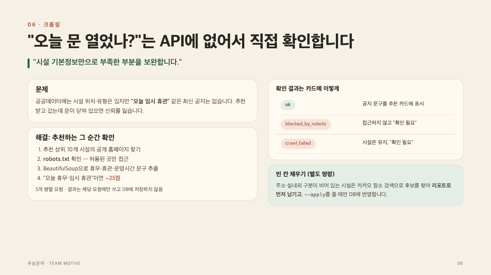

<sub>코드: [`frontend/recommendation_service.py`](frontend/recommendation_service.py) `_attach_live_operation_evidence` · [`frontend/collector.py`](frontend/collector.py) `web_evidence`</sub>

### 7-4. 예외 처리

> 데이터가 없거나 틀렸을 때 **서비스가 멈추지 않도록**, 그리고 **없는 정보를 지어내지 않도록** 미리 기준을 정했습니다.

| 예외 상황 | 처리 방법 |
|---|---|
| 데이터 수집 API 요청 실패 | 파이프라인 재시도 정책에 따라 재시도하고, 최종 실패는 실행 이력·로그에 기록 |
| JSON이 아닌 응답 | 오류 응답과 URL을 실행 로그에 기록하고 해당 작업 실패로 처리 |
| API 키 누락 | 환경변수 오류 안내 |
| DB 시설 후보 없음 | 카카오 로컬 장소 검색 결과를 보완 후보로 사용; 기본 DB 추천과 다른 간소화 점수식이며 환경 점수는 동일하게 적용되지 않음 |
| 추천 시 날씨·대기질 자료가 없음 | 확보된 조건으로만 점수를 계산하고 누락 환경값은 보정에 사용하지 않음 |
| 좌표 누락 | 거리 계산 제외 또는 후순위 처리 (이동시간 `확인 필요`) |
| 잘못된 좌표 (범위 밖·500km 초과) | 적재 전 오류 데이터로 분리, 추천 후보에서 제외 |
| 위치 권한 거부 | 선택한 지역의 중심 좌표로 대체 |
| 홈페이지 없음 | `no_homepage` 기록 |
| robots.txt 차단 | 크롤링 중단 |
| 운영 페이지 요청 실패 | `request_failed` 기록 |
| 처방 DB 검색 실패 | 조회 실패 상태를 기록하고 처방 근거를 확인한 것처럼 답하지 않음 |
| AI API 실패 | 오류를 사용자에게 안내; 추천·처방 DB 조회와 AI 답변 생성은 별도 단계 |
| AI 운동처방 검색 결과 없음 | `no_matching_prescription` 상태를 답변 context에 전달하며 검색 조건을 자동 완화하지 않음 |
| AI 운동처방 일부만 일치 | 138만 건 전체가 아니라 테이블별 최대 50건을 검색·집계하고 신뢰도(`high`·`medium`·`low`)를 함께 전달 |
| 체력·컨디션 위험 신호 | 처방 데이터를 근거로 운동을 권하지 않고 운동 중단·전문가 상담을 안내 |
| 프로필·컨디션 정보 부족 | 입력되지 않은 연령·성별·측정값은 임의로 채우지 않고 제공된 질문·프로필 범위 안에서 안내 |

> 확인되지 않은 데이터를 임의로 만들지 않고 `NULL`, `확인 필요`, `데이터 없음`으로 구분합니다.

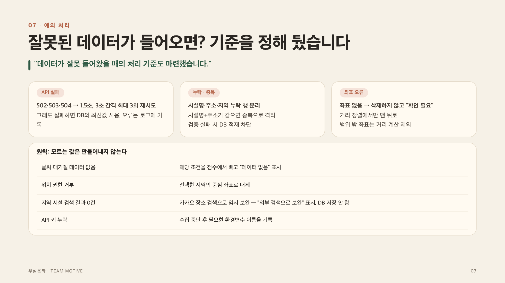

### 7-5. AI 운동 코치 '우심이'

'우심이'는 기존 챗봇 안에서 동작하는 AI 운동 코치입니다. 시설 추천처럼 새로운 카테고리를 따로 만들지 않고, 사용자가 챗봇에 컨디션이나 운동 방법을 질문하면 **운동처방 데이터와 회원 context를 근거로 오늘의 운동을 제안**합니다.

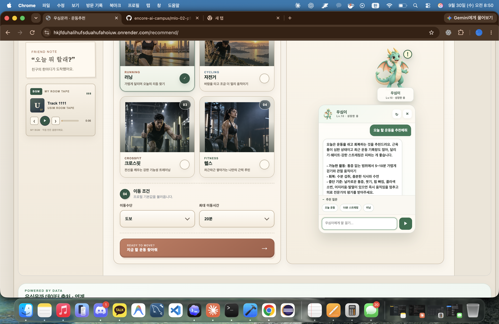

| 우심이가 참고하는 정보 | 예시 |
|---|---|
| 프로필의 지역·선호 운동 등 챗봇 context | 저장된 값이 있을 때 질문 해석과 시설 추천에 참고 |
| 최근 운동 기록 (최근 5건) · 누적 칼로리 · 레벨 | 3,200kcal · LV.12 |
| 추천 시설 상위 3곳 · 점수 · 추천 이유 · 운영 공지 | "비가 와서 실내 시설 우선" |
| 날씨 · 대기질 수치 | 기온 18℃, PM10 45 |
| `m3_processed.culture_fitness_measurement_prescriptions` | 25,070건: 연령대·성별·측정 장소별 운동처방 |
| `m3_processed.culture_location_fitness_measurement_prescriptions` | 1,389,228건: 지역·연령대·체력 측정값·측정센터·운동처방 |

#### 운동처방 데이터가 답변으로 바뀌는 과정

예를 들어 사용자가 “오늘 컨디션은 보통이고 20분 정도 가능해. 맨몸운동 추천해줘”라고 입력하면 다음 순서로 처리합니다.

1. Django가 질문 의도를 확인하고, 운동처방 질문이면 검색 키워드를 추출합니다.
2. 두 운동처방 테이블에서 처방 문구를 SQL `ILIKE`로 검색합니다. 위치기반 테이블은 프로필 지역이 있을 때 시·도·시군구 조건도 적용합니다. 연령·성별·체력 측정값은 검색 필터가 아니라 조회된 처방 행의 메타데이터입니다.
3. 138만 건 전체를 OpenAI에 보내지 않고, DB에서 조건에 맞는 후보를 최대 50건씩 가져옵니다. 같은 처방이 반복되면 묶어서 빈도와 공통 운동 키워드를 계산합니다.
4. `matched_count`, 고유 처방 수, 공통 운동, 신뢰도(`high`·`medium`·`low`)와 대표 처방 일부만 AI에 전달합니다.
5. AI는 전달된 처방 근거와 질문·최근 운동 기록을 참고해 운동, 이유, 주의사항을 자연어로 답합니다. 의학적 평가나 개인별 처방 효과를 확정하는 기능은 아닙니다.

즉, AI가 138만 건을 암기하거나 임의로 운동을 만드는 방식이 아니라 **DB에서 먼저 키워드와 가능한 지역 조건으로 후보를 좁히고, 집계된 근거를 바탕으로 자연어 답변을 생성하는 구조**입니다. 시설의 추천 순서는 여전히 거리·날씨·대기질·운영 공지를 이용한 규칙 기반 점수 계산으로 결정되며, AI는 그 결과를 설명하거나 운동 방법을 안내합니다.

#### 일부 검색 결과에서 문제가 생길 때의 기준

| 상황 | 처리 결과 |
|---|---|
| 검색 결과가 없음 | `no_matching_prescription`으로 기록하고 일치 자료가 없음을 명시; 데이터 기반 처방인 것처럼 꾸며내지 않음 |
| 일치 데이터가 너무 적음 | `low` 신뢰도로 표시하고 특정 처방을 확정적으로 말하지 않음 |
| 여러 처방이 조회됨 | 반복 처방을 집계해 대표 근거를 전달하되, 개인별 확정 진단처럼 표현하지 않음 |
| 통증·부상·호흡곤란·흉통 등 위험 신호 | 운동 추천을 중단하고 즉시 휴식 및 의료 전문가 상담 안내 |
| DB 조회 또는 AI API 실패 | 실패 상태를 구분해 안내하고, 확인하지 못한 자료를 조회한 것처럼 표현하지 않음 |

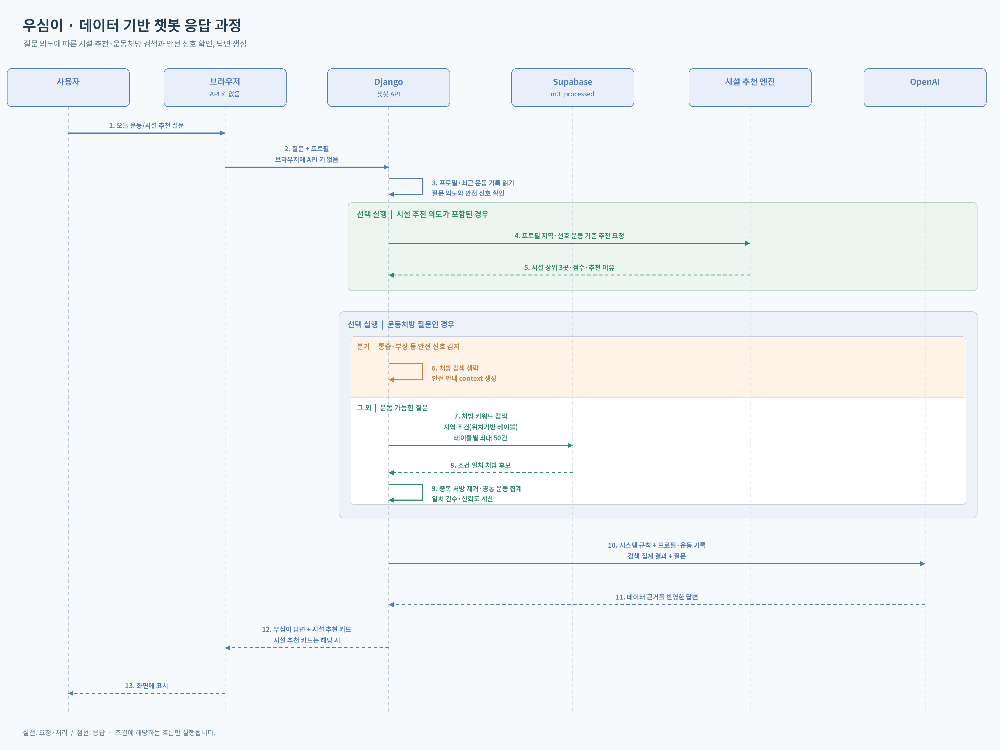

**우심이의 규칙**

- 항상 한국어 존댓말로, 짧고 친근하게 답합니다.
- 제공된 추천 데이터를 **가장 우선**하고, 모르는 실시간 날씨·운영 여부를 **아는 척하지 않습니다.**
- 통증·호흡곤란·흉통 같은 위험 신호가 나오면 **운동 중단과 의료 전문가 상담**을 안내합니다.
- 극단적인 다이어트 방법을 권하지 않습니다.
- **OpenAI API 키는 서버에만 있고**, 브라우저에는 절대 전달되지 않습니다.

<sub>코드: [`frontend/chatbot_service.py`](frontend/chatbot_service.py)</sub>

### 7-6. 운동 기록 · 레벨업 · 운동방 보상

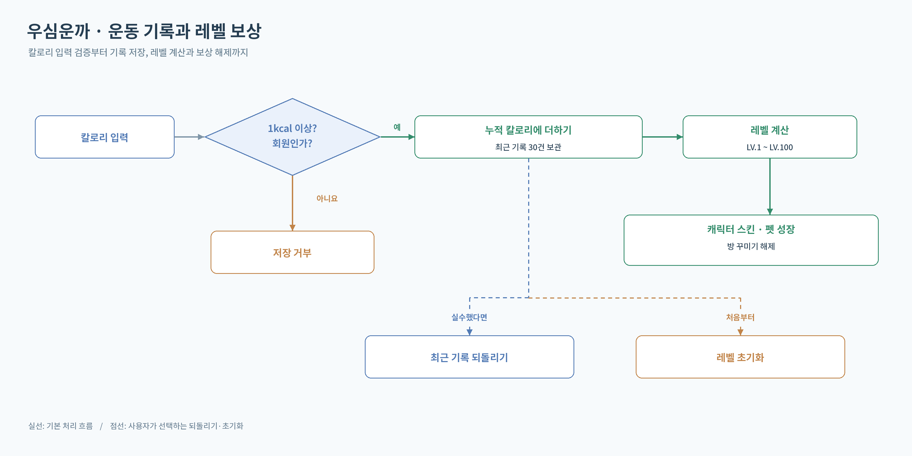

- **누적 칼로리 저장** — 운동할 때마다 기록이 쌓입니다.
- **최대 100레벨, 최대 레벨 기준 600,000kcal**
- **레벨이 오를수록 다음 레벨까지 필요한 칼로리가 늘어납니다.** (게임처럼 초반엔 빨리, 후반엔 천천히)
- **최근 운동 기록 되돌리기**, **레벨 초기화** 지원
- **100레벨 이후에도 칼로리 기록은 계속 쌓입니다.**

#### 레벨별 필요 누적 칼로리

| 레벨 | 필요 누적 칼로리 | 대략 이 정도 운동 (30분 러닝 ≈ 300kcal 기준) |
|---:|---:|---|
| LV.2 | 100 kcal | 가벼운 산책 한 번 |
| LV.5 | 547 kcal | 러닝 2회 |
| LV.10 | 2,125 kcal | 러닝 7회 |
| LV.20 | 10,247 kcal | 러닝 34회 |
| LV.40 | 57,022 kcal | 러닝 190회 |
| LV.50 | 100,633 kcal | 러닝 335회 |
| LV.100 | 600,000 kcal | 러닝 2,000회 🏆 |

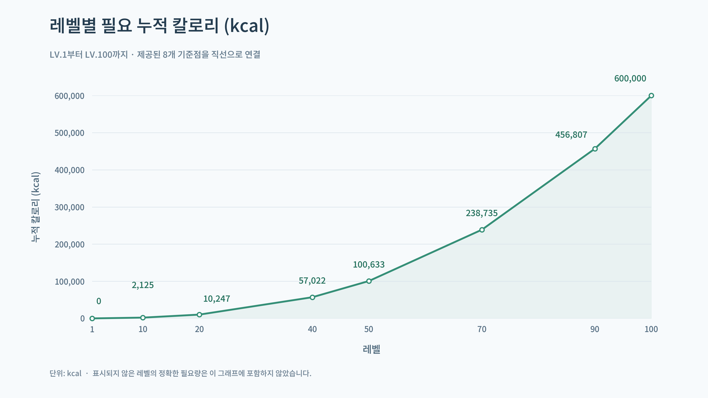

#### 레벨 보상

| 해제 레벨 | 보상 |
|---:|---|
| LV.1 | 기본 캐릭터, 한복 스킨 5종, 펫 '알' 🥚 |
| LV.5 | 한복 스킨 4종 추가, 펫 '아기 용' 🐣 |
| LV.10 | 펫 '성장한 용' 🐉 |
| LV.20 | ROCK 스킨 (남·여) |
| LV.40 | 펫 디자인 선택 (우심운까 · 핑크 용 · 파란 용) |
| LV.50 | HIGHEND 스킨 (남·여) |

| 알 (LV.1) | 아기 용 (LV.5) | 성장한 용 (LV.10) |
| :---: | :---: | :---: |
|  |  |  |

<sub>코드: [`frontend/progression.py`](frontend/progression.py) · [`frontend/dragon.py`](frontend/dragon.py)</sub>

### 7-7. 친구 방문

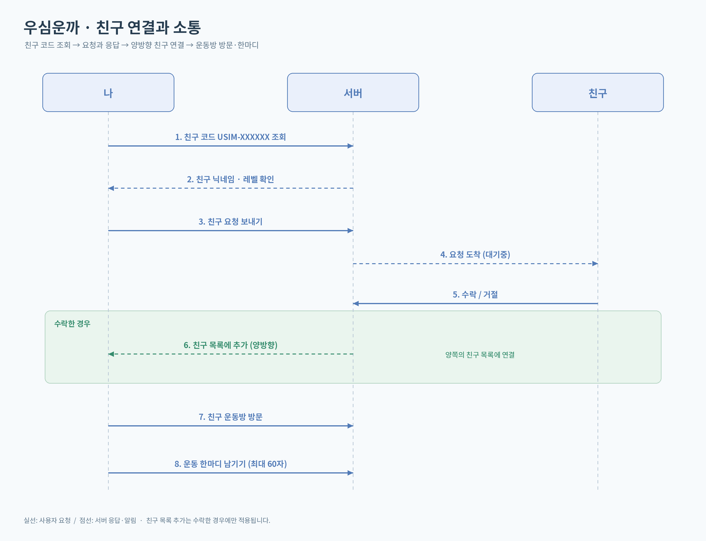

### 7-8. 주요 API

> **API** — 화면(브라우저)이 서버에게 "이거 해줘"라고 요청하는 **창구**입니다.

| 메서드 · 경로 | 역할 |
|---|---|
| `GET /api/live-recommendations/` | 시설·환경 기반 추천 결과 |
| `GET /api/account-state/` | 친구 코드·레벨·누적 운동량 |
| `POST /api/workout-calories/` (`/undo/`, `/reset/`) | 칼로리 기록 · 되돌리기 · 초기화 |
| `/api/friends/`, `/api/friends/lookup/`, `/api/friends/add/` | 친구 목록 · 코드 조회 · 추가 |
| `/api/friend-requests/`, `/api/friend-requests/respond/` | 친구 요청과 응답 |
| `/api/friend-notes/`, `/api/friend-notes/create/` | 운동 한마디 |
| `/api/room-state/`, `/api/room-state/<member_id>/` | 내 방 · 친구 방 상태 |
| `/api/dragon-character/` | 펫(용) 성장 단계 · 디자인 |
| `POST /api/chatbot/`, `/api/chatbot/clear/` | AI 운동 코치 '우심이' · 대화 초기화 |
| `GET /healthz/` | 서버 상태 확인 (배포 헬스체크) |

---

## 8. 수행결과(테스트·시연 페이지)

### 8-1. 데이터 처리 결과

#### 왜 정제가 필요할까? — 체육시설 원본 1,000건 샘플 점검

(2026-09-29 실제 API 응답 기준)

| 항목 | 건수 | 비율 |
|---|---:|---:|
| 정상운영 | 824 | 82.4% |
| 폐업 | 172 | 17.2% |
| 좌표 없음 | 60 | 6.0% |
| 좌표 (0, 0) | 68 | 6.8% |
| 실내외 미기재 | 163 | 16.3% |
| 시설명+주소 중복 | 7 | 0.7% |

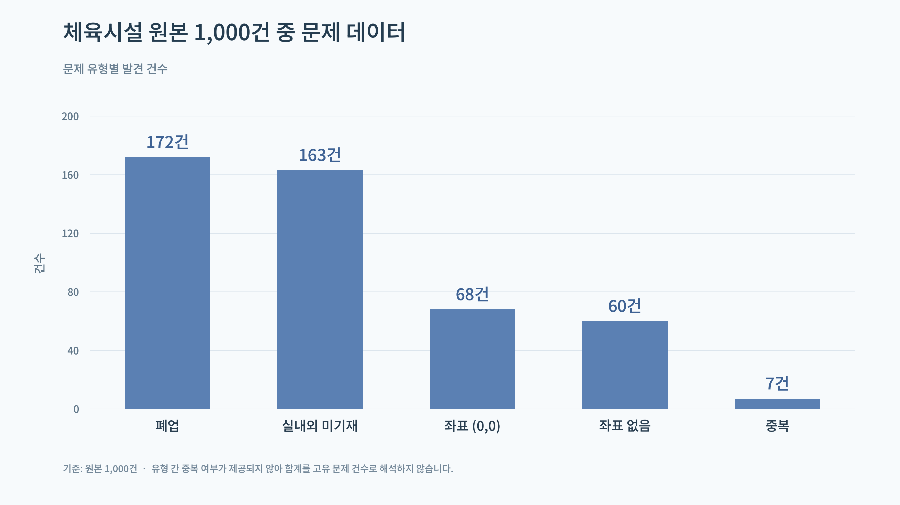

→ 원본을 그대로 쓰면 1,000곳 중 **약 13%는 거리 계산이 불가능**하고, **약 17%는 이미 문을 닫은 곳**입니다. **전처리와 품질검증이 필요한 이유**입니다.

| API | 응답 상태 | 비고 |
|---|---|---|
| 전국체육시설 | `00 NORMAL` | 전체 153,605건 |
| 기상청 초단기실황 | `00 NORMAL` | 12:00 기준 7개 항목 |
| 에어코리아 | 정상 | 측정소 23곳 |

#### 원본 → 표준 컬럼 변환 예시

| 원본 필드 | 원본 값 | 표준 컬럼 | 변환 결과 |
|---|---|---|---|
| `faci_nm` | 스트롱라인 면목점 | `facility_name` | 스트롱라인 면목점 |
| `ftype_nm` | 체력단련장 | `facility_type` | 헬스 |
| `faci_lat` / `faci_lot` | "37.5932…" / "127.0930…" (문자) | `latitude` / `longitude` | 숫자 |
| `inout_gbn_nm` | 실내 | `indoor_outdoor` | 실내 |

#### 파이프라인 처리 결과 — 별도 실행 스냅샷

아래 표는 18개 데이터셋의 **한 파이프라인 실행 집계**입니다. DB 전체 `COUNT(*)` 스냅샷과는 측정 시점·집계 범위가 다르므로 두 합계를 같은 값으로 취급하면 안 됩니다. 실행 집계는 **2,445,724건 수집 = 2,367,256건 정제·적재 + 78,468건 제외**이며, 적재분 중 **135,920건(5.7%)**은 삭제하지 않고 품질 확인 대상으로 표시했습니다.

**수치 차이의 정리:** DB 전체 스냅샷의 `m3_processed`는 **2,369,349행**으로, 위 실행의 적재 합계보다 **2,093행 많습니다**. `m3_raw` 전체는 **2,511,493행**으로 실행 수집 합계보다 **65,769행 많습니다**. 이는 서로 다른 집계(테이블의 스냅샷 행 수 vs 단일 실행의 입력·출력 건수)라서 차이를 임의로 더하거나 빼지 않았습니다. 이 저장소에는 해당 DB 스냅샷의 쿼리 출력과 파이프라인 실행 원본 로그가 포함돼 있지 않아, 차이의 세부 원인이나 이후 변경분은 여기서 재검증할 수 없습니다.

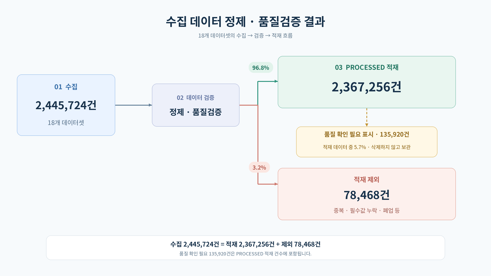

> **"제외"와 "품질 확인 필요"는 다릅니다.**
> - **제외** — 중복이거나 필수 정보가 없어 쓸 수 없는 행. 정제 단계에서 빠지고 적재되지 않습니다.
> - **품질 확인 필요** — 쓸 수는 있지만 일부 값(예: 좌표, 측정값)이 비었거나 의심스러운 행. **지우지 않고 표시만** 해 두어, 나중에 확인·보완할 수 있게 했습니다.
>
> **실행 내 건수 검산:** 2,445,724(수집) = 2,367,256(정제·적재) + 78,468(제외). 표의 18개 데이터셋 합계 안에서는 일치합니다. 이는 한 실행의 산술 검산이며, 현재 DB 스냅샷과 동일하다는 뜻은 아닙니다.

#### 데이터셋별 수집·정제·품질검증 결과

| 구분 | 데이터셋 | 수집 건수 | 정제 건수 | 품질 확인 필요 | 제외 건수 | DB 적재 건수 |
|---|---|---:|---:|---:|---:|---:|
| 🏛️ 시설 | 체육시설 (전국체육시설 API) | 153,605 | 106,521 | 0 | 47,084 | 106,521 |
| 🏛️ 시설 | 공공체육시설 운영정보 | 7,334 | 7,331 | 0 | 3 | 7,331 |
| 🌦️ 환경 | 초단기예보 | 198 | 198 | 0 | 0 | 198 |
| 🌦️ 환경 | 초단기실황 | 24 | 24 | 0 | 0 | 24 |
| 🌦️ 환경 | 대기질 (에어코리아) | 1,402 | 1,402 | 157 | 0 | 1,402 |
| 🌦️ 환경 | 기상특보 | 186 | 128 | 0 | 58 | 128 |
| 🌦️ 환경 | 기상특보 현황 | 1 | 0 | 0 | 1 | 0 |
| 🛟 안전 | AED | 63,626 | 63,626 | 0 | 0 | 63,626 |
| 🛟 안전 | 자전거 사고다발지역 | 5,046 | 5,046 | 0 | 0 | 5,046 |
| 🚶 경로 | 두루누비 구간 | 139 | 139 | 0 | 0 | 139 |
| 🚶 경로 | 두루누비 경로 | 4 | 4 | 0 | 0 | 4 |
| 📚 문화빅데이터 | 전국체육시설 현황 | 152,968 | 140,224 | 1,598 | 12,744 | 140,224 |
| 📚 문화빅데이터 | 전국공공체육시설 | 44,612 | 42,879 | 10,553 | 1,733 | 42,879 |
| 📚 문화빅데이터 | 학교개방 체육시설 | 1,206 | 1,206 | 0 | 0 | 1,206 |
| 📚 문화빅데이터 | 공공체육시설 프로그램 | 408,761 | 401,865 | 123,612 | 6,896 | 401,865 |
| 📚 문화빅데이터 | 체육시설 안전점검 | 192,314 | 182,365 | 0 | 9,949 | 182,365 |
| 📚 문화빅데이터 | 체력 측정별 운동처방 | 25,070 | 25,070 | 0 | 0 | 25,070 |
| 📚 문화빅데이터 | 위치기반 체력측정·운동처방 | 1,389,228 | 1,389,228 | 0 | 0 | 1,389,228 |
| | **합계** | **2,445,724** | **2,367,256** | **135,920** | **78,468** | **2,367,256** |

#### 기록된 서비스 DB 스냅샷 기준 활용 결과

파이프라인 실행 집계와 별도로, README에 기록된 Supabase 스냅샷에서 다음 데이터 행 수를 확인했으며 서비스 기능에 연결했습니다. 이 값 역시 실시간 조회값은 아닙니다.

| 서비스 데이터 | DB 행 수 | 실제 결과 |
|---|---:|---|
| `m3_processed.facility` | 106,521 | 프로필 지역·선호 종목에 맞는 추천 시설 후보 생성 |
| `m3_processed.weather_ultra_ncst` | 32 | 기온·습도·강수·풍속을 실내·실외 점수에 반영 |
| `m3_processed.air_quality` | 3,421 | PM10·PM2.5를 대기질 보정에 반영 |
| `m3_processed.aed` | 63,626 | 추천 상세 화면에 AED 설치 정보 표시 |
| `m3_processed.culture_sports_facility_safety_inspections` | 182,365 | 추천 상세 화면에 안전점검 결과·일자 표시 |
| `m3_processed.culture_fitness_measurement_prescriptions` | 25,070 | AI 코치가 처방 키워드로 검색; 연령·성별 등은 결과 행의 메타데이터 |
| `m3_processed.culture_location_fitness_measurement_prescriptions` | 1,389,228 | AI 코치가 처방 키워드와 지역(가능한 경우)으로 검색; 측정값·센터는 결과 근거 |
| `m3_monitoring.pipeline_run_history` | 86 | 파이프라인 정상·실패·DQ 실행 이력 확인 |

AI 코치는 1,389,228건을 그대로 모델에 전달하지 않습니다. 질문과 프로필 조건으로 DB를 먼저 검색하고, 일치 건수·대표 처방·공통 운동을 집계한 소량의 근거만 전달합니다. 검색 결과가 없거나 위험 신호가 있으면 그 사실을 답변에 표시하고, 확인되지 않은 처방을 만들어내지 않습니다.

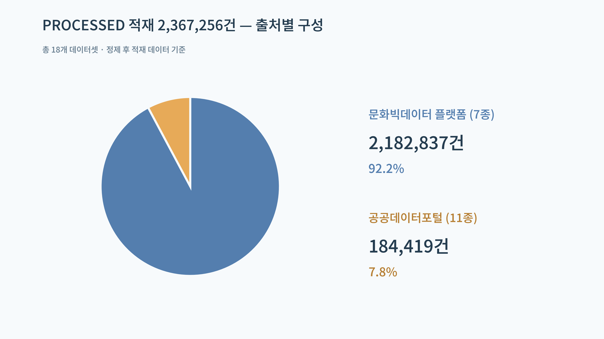

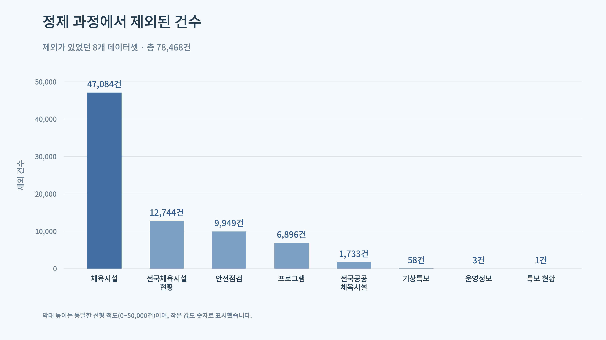

#### 품질검사(DQ) 전·후

| 검사 항목 | 검사 전 | 검사 후 | 처리 |
|---|---:|---:|---|
| 전체 행 수 | 2,445,724건 | 2,367,256건 | 정제 규칙에 따라 78,468건 제외 |
| 체육시설 행 수 | 153,605건 | 106,521건 | 47,084건 제외, 미설명 행 손실 0건 |
| 기상특보 중복 | 186건 | 128건 | (지점, 발표시각, 발표번호) 기준 중복 58건 제외 |
| 기상특보 현황 | 1건 | 0건 | 활성·예비 특보가 아닌 1건 제외 |
| AED 행 수 | 63,626건 | 63,626건 | 행 손실 0건 |
| AED 빈 값 정규화 | 빈 문자열 등 33건 | NULL 33건 | 의미상 결측값을 NULL로 표준화 |
| AED 자료형 변환 신규 NULL | 0건 | 0건 | 변환에 따른 값 손실 없음 |
| AED Row Tracking 이상 | 0건 | 0건 | 누락·미확인·중복 ID 없음 |

> 🙋 **용어 풀이**
> - **빈 값 정규화** — `""`, `" "`, `"-"`처럼 제각각인 "값 없음" 표기를 데이터베이스의 공식 빈 값인 `NULL` 하나로 통일하는 작업입니다. 그래야 "빈 값이 몇 개인지" 정확히 셀 수 있습니다.
> - **자료형 변환 신규 NULL** — 문자 `"37.5"`를 숫자 `37.5`로 바꿀 때, 변환에 실패해 **새로 빈 값이 생기면** 데이터가 몰래 사라진 것입니다. 0건이면 변환 중 잃어버린 값이 없다는 뜻입니다.
> - **Row Tracking** — 원본의 모든 행에 번호를 붙여, 정제 후에 **빠진 행 · 모르는 행 · 중복된 행**이 없는지 하나하나 대조하는 검사입니다.
> - 기상특보 중복 기준 `(stnId, tmFc, tmSeq)` = (발표 지점, 발표 시각, 발표 번호)

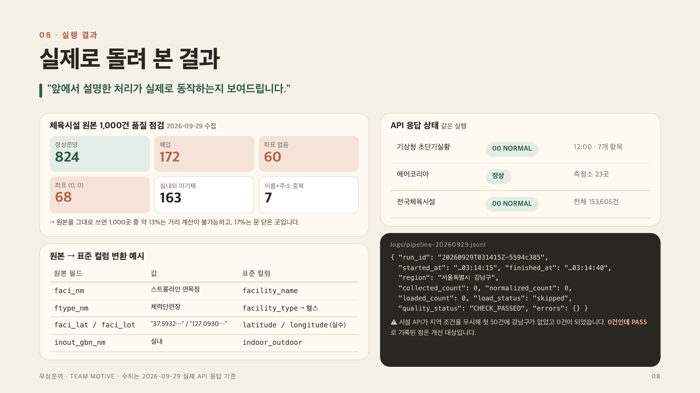

#### 발견한 문제와 개선할 점

- 시설 API가 지역 조건을 무시해 첫 50건에 대상 지역이 없으면 0건 수집인데도 `CHECK_PASSED`로 기록됨 → **0건 수집을 검증 실패로 처리**
- 좌표 (0, 0)을 유효 좌표로 통과시키지 않도록 검증 규칙 추가
- 폐업 시설을 적재 전에 제외
- 시설 API 지역 필터 보완 (페이지 순회)
- 추천 → 운동 기록 전환율 측정

### 8-2. 기능 테스트

| 테스트 항목 | 확인 방법 | 기대 결과 |
|---|---|---|
| 프로필 지역 기준 추천 | 프로필 지역 저장 후 추천 요청 | 해당 시·군·구 시설만 표시 |
| 선호 운동 기준 필터링 | 헬스만 선택 | 헬스 시설만 표시 |
| 추천 점수순 정렬 | 추천 결과 확인 | 점수 높은 순, 동점이면 가까운 순 |
| 추천 상세·결정 | 점수 상세 확인 후 결정 버튼 | 점수 산출 근거·환경·안전정보 확인; 선택 저장 후 지도는 새 탭에서 열리고 기존 화면 유지 |
| 거리·날씨·대기질 반영 | 추천 이유 확인 | "비가 와서 실내 시설 우선" 등 표시 |
| API 실패 처리 | API 키 제거 후 실행 | 서비스는 유지, 오류 기록 |
| 좌표 오류 처리 | 좌표 없는 시설 | 이동시간 `확인 필요`, 순위 후순위 |
| 운동 칼로리 저장 | 300kcal 기록 | 누적 칼로리 +300 |
| 입력값 검증 | 0 또는 문자 입력 | 저장 거부 메시지 |
| 레벨업·보상 확인 | 547kcal 도달 | LV.5, 아기 용 · 한복 스킨 해제 |
| 레벨 초기화 | 초기화 버튼 | LV.1, 0kcal, 기본 캐릭터 |
| 최근 기록 되돌리기 | 되돌리기 버튼 | 마지막 기록만 차감 |
| AI 챗봇 응답 | "오늘 어디서 운동할까?" | 추천 시설과 이유를 포함한 답변 |
| 운동처방 근거 없음 | DB에 없는 키워드로 질문 | 검색 결과 없음으로 처리하고 일치 처방을 지어내지 않음 |
| 친구 방문·운동 한마디 | 친구 코드로 요청 → 수락 → 방문 | 친구 방 표시, 한마디 등록 |
| 게스트 모드 | 게스트로 칼로리 기록 시도 | "보기만 가능" 안내 |

### 8-3. 서비스 시연 페이지

**배포 사이트:** [https://hkjfduhalihufsduahufahoiuw.onrender.com/](https://hkjfduhalihufsduahufahoiuw.onrender.com/)

> 무료 Render 서버라 첫 접속 시 서버가 깨어나는 데 30초~1분 정도 걸릴 수 있습니다.

#### ① 메인 운동방 — 오늘의 활동을 한눈에

우심운까 계정의 실제 서비스 화면입니다. 프로필 요약, 방 꾸미기, 오늘의 추천, 누적 운동·레벨, 친구 한마디와 데이터 출처를 한곳에서 확인합니다. 운동방의 캐릭터와 가구는 드래그해 배치할 수 있고, 배치는 자동 저장됩니다.


#### ② 프로필 — 운동 추천 기본값과 오늘의 컨디션

캐릭터·오늘의 분위기와 기본 운동 지역, 선호 종목, 이동 방식을 관리합니다. 추천 화면은 프로필 기본값을 불러오며, 특정 날짜의 추천 조건을 바꿔도 프로필을 덮어쓰지 않습니다.

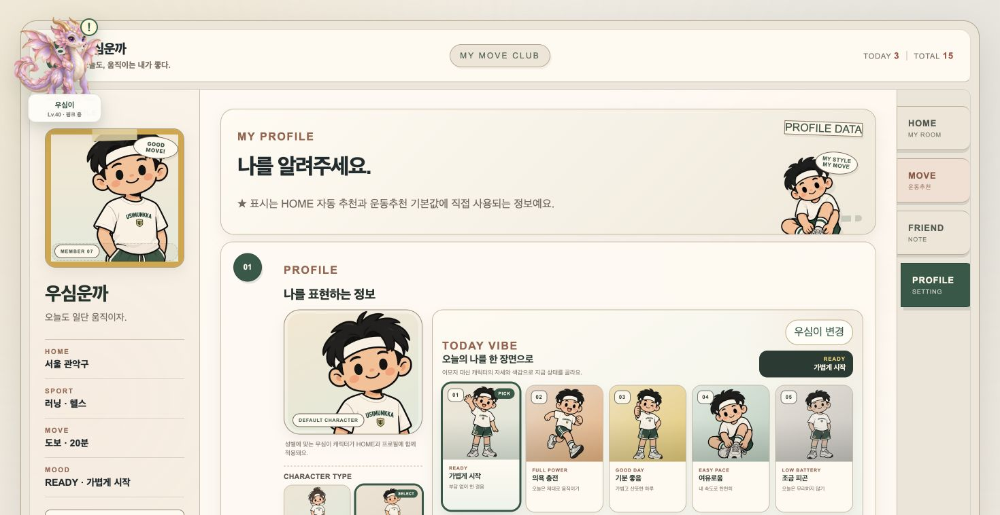

#### ③ 장소 추천 — 조건을 정하고 후보를 조회

지역 또는 현재 위치, 가능한 전체 시간, 러닝·자전거·크로스핏·헬스 중 한 종목, 이동수단과 최대 이동시간을 설정합니다. 프로필 기본값으로 바로 조회할 수도 있습니다.


#### ④ 추천 결과 — 점수와 데이터 근거 확인

실제 계정의 서울 관악구·러닝·도보 20분·60분 조건으로 조회한 결과 예시입니다. 시설 DB 후보에 거리, 기온·습도·강수·풍속, PM10·PM2.5와 확인 가능한 운영 공지를 반영해 점수와 이유를 표시합니다. 상세보기와 결정 후 지도 이동은 다음 실제 캡처에서 이어서 확인할 수 있습니다.


#### ⑤ 추천 상세 — 점수 산출과 실제 측정값

추천 카드의 상세 보기에서 기본·거리·환경·대기질·운영정보 점수와 확인된 측정값을 함께 봅니다. 아래는 캡처 시점의 관악구민운동장 예시(기온 27℃, 습도 40%, 강수 0mm, 풍속 1.7m/s, PM10 38, PM2.5 17)이며, 환경값은 조회 시점에 따라 바뀝니다. AED 위치와 안전점검 결과도 제공 여부에 따라 표시됩니다.

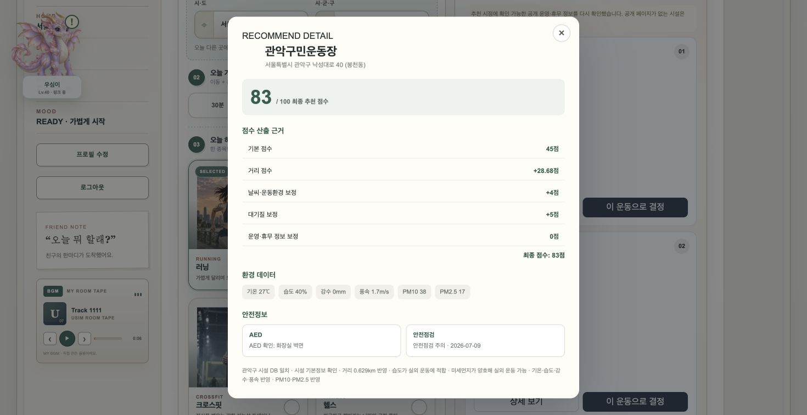

#### ⑥ 카카오맵 — 선택한 시설 위치로 이동

**이 운동으로 결정**을 누르면 추천 선택을 저장하고, 해당 시설 위치를 지정한 카카오맵을 새 탭으로 엽니다. 실제 시연에서는 관악구민운동장을 선택해 지도가 해당 시설에 초점을 맞추는 것까지 확인했습니다.

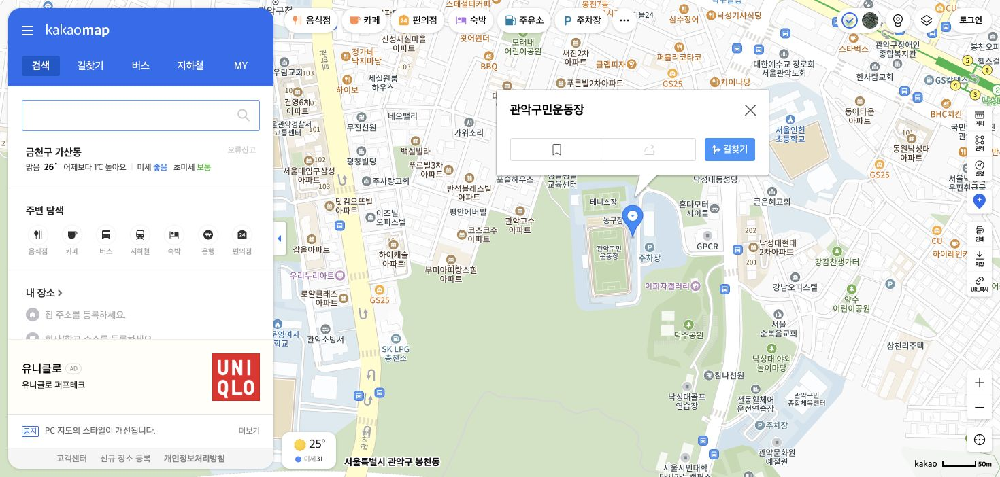

#### ⑦ 우심이 AI 코치 — 대화로 장소와 운동 방법 추천

챗봇은 서버에서 처리되며, 질문 의도에 따라 운동처방 근거와 프로필·최근 기록을 참고해 답합니다. 일반 추천 질문에는 주변 장소 후보와 이동시간, 시간에 맞춘 운동 루틴 및 안전수칙을 대화로 안내합니다. 아래 시연은 개인 건강상태를 추정하지 말라고 명시한 일반 초보 러닝 질문에 대한 응답입니다. 추천 결과와 규칙 기반 시설 점수는 별도 기능이며, 위험 신호가 감지되면 운동 중단과 전문가 상담을 안내합니다.


#### ⑧ 운동 기록과 레벨 — 활동을 방 성장으로 연결

칼로리를 기록하면 누적 운동량과 최근 기록이 갱신되고 레벨 진행도가 계산됩니다. 실제 계정의 예시 화면에는 누적 57,022 kcal와 LV.40이 표시되어 있습니다. 기록 입력·되돌리기·레벨 초기화는 계정 데이터를 변경하므로 시연 캡처에서는 실행하지 않았습니다.

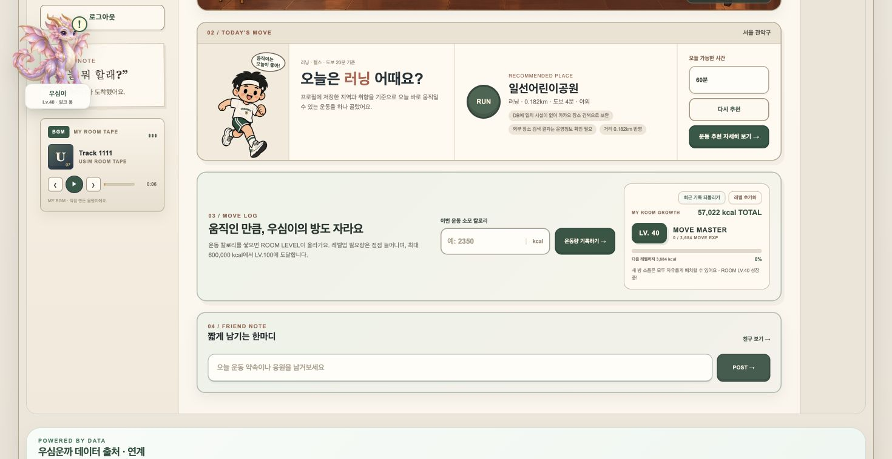

#### ⑨ 방 꾸미기와 보상 — 소품·테마·캐릭터 스킨

방 톤, 가구 표시, 소품 배치 및 레벨 해제 스킨을 꾸미기 패널에서 살펴볼 수 있습니다. 미리보기만 열어 촬영했으며 저장은 누르지 않았습니다.

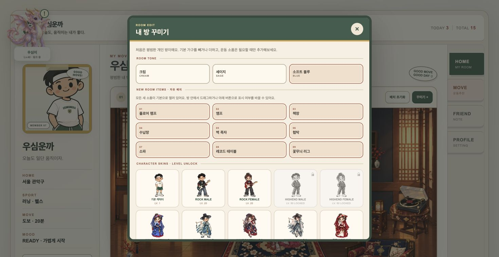

#### ⑩ 친구 운동방 — 코드로 연결하고 운동 한마디

친구 코드 조회 후 요청·수락으로 연결하고, 친구 운동방 방문과 운동 한마디를 주고받습니다. 아래는 코드 조회 전 화면입니다. 캡처에는 친구들의 프로필과 위치 정보가 노출되지 않도록 코드 입력 영역만 담았습니다.


<details>
<summary><strong>🛠️ 로컬 실행 방법 (개발자용) 펼쳐보기</strong></summary>

```bash
git clone https://github.com/2nd-MLOps-engineer/hkjfduhalihufsduahufahoiuw.git
cd hkjfduhalihufsduahufahoiuw
python3 -m venv .venv && source .venv/bin/activate
pip install -r requirements.txt
cp .env.example .env   # API 키와 Supabase PostgreSQL 연결용 DATABASE_URL 입력
python manage.py migrate
python manage.py runserver
```

- 추천 기능은 Supabase PostgreSQL의 PostGIS 확장과 시설·날씨·대기질 정제 테이블 데이터를 사용합니다. `migrate`는 회원·운동량 등 Django 테이블을 연결된 데이터베이스에 만듭니다.
- 필요한 환경변수: `DATABASE_URL`, `KAKAO_REST_API_KEY`, `KAKAO_JAVASCRIPT_KEY`, `KMA_SERVICE_KEY`, `AIRKOREA_SERVICE_KEY`, `FACILITY_API_URL`, `FACILITY_SERVICE_KEY`, `OPENAI_API_KEY`(챗봇)
- 수집 테스트: `python frontend/collector.py --region "서울특별시 관악구" --limit 50`
- 시설 누락값 보완 리포트: `python manage.py enrich_facilities --limit 100` (`--apply`를 줄 때만 DB 반영)

</details>

---

## 9. 한 줄 회고

| | 팀원 | 회고 |
|:---:|---|---|
|  | **신경호** | 사용자 경험을 고려한 프론트엔드 구현과 UI 설계, 발표자료 구성을 함께 수행하며 기술적 완성도뿐 아니라 서비스의 가치를 명확히 전달하는 역량의 중요성을 체감했습니다. |
|  | **백선영** | 여러 공공데이터를 하나의 서비스로 연결하는 과정에서, 데이터 수집뿐만 아니라 정제·품질검증·운영까지 함께 설계하는 것이 중요하다는 것을 깨달았고, 직접 구현하며 많이 배우고 성장할 수 있었습니다. |
|  | **김형준** | 다양한 데이터를 하나의 데이터베이스로 통합하고 서버를 구축해 실제 운영 가능한 웹 서비스로 완성한 과정은, 데이터와 서비스를 연결하는 역량을 키운 값진 경험이었습니다. |
|  | **류지예** | 단순히 하나의 화면을 완성하는 것이 얼마나 많은 생각이 오가는 것인지를 배웠습니다. 일상 속에서 너무나 당연하게 여겨왔던 것들에 정말 많은 수고와 노력이 숨어있음을 깨닫게 되어 정말 뜻깊은 시간이 되었습니다. |

---

## 📖 용어 사전

| 용어 | 쉬운 설명 |
|---|---|
| **API** | 프로그램끼리 정보를 주고받는 창구. "기상청아, 지금 관악구 날씨 알려줘" 같은 요청을 보내는 곳 |
| **공공데이터** | 정부·공공기관이 누구나 쓸 수 있도록 공개한 데이터 (체육시설 목록, 날씨, 미세먼지 등) |
| **프론트엔드** | 사용자가 보는 화면 부분 |
| **백엔드** | 화면 뒤에서 계산·저장을 담당하는 서버 부분 |
| **Django** | 파이썬으로 웹 서비스의 백엔드를 만드는 도구 |
| **Supabase** | PostgreSQL 데이터베이스·API 등을 관리형으로 제공하는 서비스. 이 프로젝트의 운영 데이터베이스 |
| **PostgreSQL** | Supabase가 데이터를 표 형태로 저장하는 관계형 데이터베이스 엔진 |
| **PostGIS** | Supabase PostgreSQL에 설치해 좌표·거리 등 공간 데이터를 처리하는 확장 기능 |
| **좌표 (위도·경도)** | 지구 위의 위치를 숫자로 나타낸 것 (예: 37.59, 127.09) |
| **RAW / PROCESSED** | RAW = 받은 그대로의 원본, PROCESSED = 깨끗하게 정리한 데이터 |
| **전처리 (Cleaning)** | 제각각인 이름·형식을 통일하고 잘못된 값을 정리하는 작업 |
| **품질검증 (DQ, Data Quality)** | 빠진 값·중복·말이 안 되는 값이 없는지 검사하는 작업 |
| **파이프라인** | 수집 → 정제 → 검증 → 저장을 자동으로 이어 붙인 흐름 |
| **크롤링** | 프로그램이 공개 웹페이지의 내용을 자동으로 읽어 오는 것 |
| **robots.txt** | 웹사이트가 "자동 프로그램은 여기까지만 들어와 주세요"라고 적어 둔 안내문 |
| **규칙 기반 추천** | 사람이 정한 기준(점수표)으로 순위를 매기는 방식. AI 학습 없이도 이유를 설명할 수 있음 |
| **ERD** | 데이터베이스 표들과 그 관계를 그린 설계도 |
| **환경변수** | 비밀번호·API 키처럼 코드에 직접 쓰면 안 되는 값을 서버에 따로 보관하는 방법 |
| **해시 (Hash)** | 비밀번호를 원래대로 되돌릴 수 없는 값으로 바꿔 저장하는 방식 |
| **배포 (Render)** | 내 컴퓨터에서만 돌던 서비스를 인터넷 서버에 올려 누구나 접속하게 하는 것 |
| **OpenAI API** | ChatGPT를 만든 회사의 AI를 우리 서비스 안에서 쓸 수 있게 해 주는 창구 |

---

<div align="center">

**예전에는 내 방을 꾸미려고 접속했다면,<br>이제는 운동으로 내 방을 채우는 경험을 만들고 싶었습니다.**

우심운까 · TEAM MOTIVE

</div>
