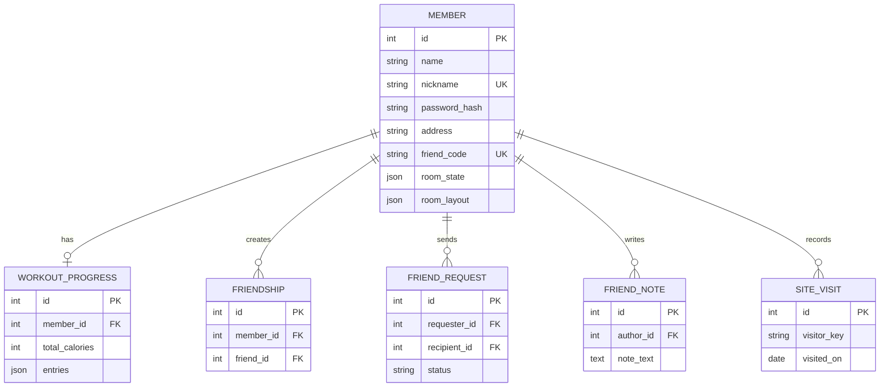

<div align="center">

# 🏃 우심운까 · WoosimWoonkka

### 오늘도, 움직이는 내가 좋다

<a href="https://hkjfduhalihufsduahufahoiuw.onrender.com/"></a>
<a href="https://www.djangoproject.com/"></a>
<a href="https://www.postgresql.org/"></a>
<a href="#1-팀-소개"></a>

<p>싸이월드 감성의 운동방과 AI 코치 우심이를 통해<br />오늘 운동하기 좋은 장소를 추천하고 기록을 이어가는 서비스</p>

</div>

우심운까는 싸이월드의 미니룸과 친구 방문에서 착안해, 사용자가 다시 찾아오고 싶은 운동 공간을 만드는 웹 서비스입니다. 지역·날씨·대기질·운동 취향을 연결해 오늘 운동하기 좋은 장소를 추천하고, 운동 후 기록과 운동방 꾸미기로 다음 운동을 이어가게 합니다. 서비스 안의 AI 운동 코치 ‘우심이’는 사용자의 질문에 답하고 추천 결과를 쉽게 설명합니다. 이번 단위 프로젝트에서는 웹 서비스와 분리된 공공데이터 수집·전처리·품질검증·적재·스케줄링 파이프라인을 함께 정리했습니다.

> 발표 전체 메시지: **“다시 찾아가고 싶던 나만의 공간을, 다시 운동하고 싶은 공간으로 만들었습니다.”**

## 웹사이트와 저장소

| 항목 | 주소 |
| --- | --- |
| 서비스 URL | [https://hkjfduhalihufsduahufahoiuw.onrender.com/](https://hkjfduhalihufsduahufahoiuw.onrender.com/) |
| 제출 저장소 | [mlo-02-p1-team3](https://github.com/encore-ai-campus/mlo-02-p1-team3) |
| 웹 서비스 원본 | [woosimwoonkka-web](https://github.com/2nd-MLOps-engineer/woosimwoonkka-web) |
| 데이터·백엔드 원본 | [hkjfduhalihufsduahufahoiuw](https://github.com/2nd-MLOps-engineer/hkjfduhalihufsduahufahoiuw) |

> 현재 배포 서비스는 이 저장소가 아닌 별도 배포 설정에서 운영됩니다. 이 저장소는 프로젝트 문서와 평가 설명을 보관합니다.

## 프로젝트 파일 구조

```text
woosimwoonkka-web/
├── config/                         # Django 프로젝트 설정·URL·WSGI/ASGI
├── frontend/                       # 서비스 앱: 화면, 회원, 추천, 운동 기록, 친구 기능
│   ├── templates/                  # Django HTML 템플릿
│   ├── static/                     # CSS·JavaScript·이미지 등 정적 파일
│   ├── migrations/                 # 데이터베이스 스키마 변경 이력
│   ├── collector.py                # 공공데이터 수집·전처리·품질검증
│   ├── chatbot_service.py          # AI 운동 코치와 추천 데이터 연결
│   ├── chatbot_views.py            # AI 챗봇 API 요청·응답 처리
│   ├── recommendation_service.py   # 운동 장소 추천 로직
│   ├── models.py                   # 회원·운동·시설 관련 데이터 모델
│   ├── views.py                    # 웹 화면과 서비스 요청 처리
│   └── tests.py                    # 서비스 테스트 코드
├── pipeline/                       # 독립 실행 가능한 데이터 파이프라인
│   ├── run_pipeline.py             # 수집·전처리·검증·적재 일괄 실행
│   └── scheduler.py                # 파이프라인 주기 실행 스케줄러
├── docs/                           # 평가 자료·품질 기준·시연 이미지
│   ├── assessment/                 # 데이터 품질검증 기준
│   └── images/                     # 발표용 이미지와 기술 스택 아이콘
├── manage.py                       # Django 관리 명령 진입점
├── requirements.txt                # Python 의존성 목록
├── render.yaml                     # Render 배포 설정
├── .env.example                    # 환경변수 설정 예시
├── CRAWLING_AND_RECOMMENDATION.md  # 수집·추천 로직 설명
└── README.md                       # 프로젝트 소개·실행·평가 문서
```

### 디렉터리별 역할

| 경로 | 역할 |
| --- | --- |
| `config/` | Django 설정, URL 라우팅, 배포용 WSGI/ASGI 구성을 관리합니다. |
| `frontend/` | 사용자 화면과 회원·추천·운동 기록·친구·AI 운동 코치 기능을 제공하고 서비스 데이터를 처리합니다. |
| `pipeline/` | 웹 서비스와 분리된 수집·전처리·품질검증·적재·스케줄링을 담당합니다. |
| `docs/` | 데이터 품질검증 기준, 아키텍처, 데이터 흐름, 시연 화면을 보관합니다. |
| `manage.py` | 마이그레이션, 서버 실행 등 Django 관리 명령을 실행합니다. |
| `render.yaml` | 배포 환경의 서비스 실행 명령과 환경 설정을 정의합니다. |
| `.env.example` | API 키와 데이터베이스 연결 정보에 필요한 환경변수 형식을 안내합니다. |

<table align="center">
  <tr>
    <td align="center"><a href="#1-팀-소개">👥<br /><b>팀 소개</b></a></td>
    <td align="center"><a href="#2-프로젝트-개요">🎯<br /><b>프로젝트</b></a></td>
    <td align="center"><a href="#3-기술-스택">🧩<br /><b>기술 스택</b></a></td>
    <td align="center"><a href="#8-수행-결과">🖥️<br /><b>시연 결과</b></a></td>
    <td align="center"><a href="#9-한-줄-회고">💬<br /><b>회고</b></a></td>
  </tr>
</table>

> **작은 움직임이 다음 운동으로 이어지도록** 추천부터 기록, 운동방 꾸미기까지 하나의 흐름으로 연결했습니다.

## 목차

- [1. 팀 소개](#1-팀-소개)
- [2. 프로젝트 개요](#2-프로젝트-개요)
- [3. 기술 스택](#3-기술-스택)
- [4. WBS](#4-wbs)
- [5. 요구사항 명세서](#5-요구사항-명세서-sr--ur)
- [6. ERD](#6-erd)
- [7. 주요 프로시저](#7-주요-프로시저)
- [8. 수행 결과](#8-수행-결과)
- [8.1 데이터 엔지니어링 파이프라인 참고](#81-데이터-엔지니어링-파이프라인-참고)
- [8.2 백엔드 구현·테스트 참고](#82-백엔드-구현테스트-참고)
- [8.3 실행 방법](#83-실행-방법)
- [9. 한 줄 회고](#9-한-줄-회고)

## 1. 팀 소개

### 팀명

**MOTIVE**

### 팀원

<table>
  <thead>
    <tr height="48" valign="middle">
      <th width="14%">팀원</th>
      <th width="23%">역할</th>
      <th width="43%">담당 업무</th>
      <th width="20%">GitHub</th>
    </tr>
  </thead>
  <tbody>
    <tr height="88" valign="middle">
      <td align="center" nowrap="nowrap"><b>신경호</b></td>
      <td>프론트엔드 · 발표자료</td>
      <td>서비스 화면 구현, 사용자 인터페이스 구성, 발표자료 준비</td>
      <td><a href="https://github.com/Shinkyeongho">Shinkyeongho</a></td>
    </tr>
    <tr height="88" valign="middle">
      <td align="center" nowrap="nowrap"><b>류지예</b></td>
      <td>프론트엔드 · 발표자료</td>
      <td>서비스 화면 구현, 사용자 경험 구성, 발표자료 준비</td>
      <td><a href="https://github.com/callijee22-ship-it">callijee22-ship-it</a></td>
    </tr>
    <tr height="88" valign="middle">
      <td align="center" nowrap="nowrap"><b>백선영</b></td>
      <td>서비스 기획 · 데이터 엔지니어링</td>
      <td>서비스 기획, 공공데이터 조사·선정, 데이터 수집·정제·품질검증, PostgreSQL 데이터 파이프라인 구축, 스케줄링·모니터링·알림 자동화</td>
      <td><a href="https://github.com/baikAnalyst">baikAnalyst</a></td>
    </tr>
    <tr height="88" valign="middle">
      <td align="center" nowrap="nowrap"><b>김형준</b></td>
      <td>백엔드 · 프로젝트 전반</td>
      <td>Django 백엔드, 기능 연동, 배포 설정 및 프로젝트 전반</td>
      <td><a href="https://github.com/kimhyounjun">kimhyounjun</a></td>
    </tr>
  </tbody>
</table>

## 2. 프로젝트 개요

### 프로젝트명

**우심운까: 공공데이터 기반 운동 장소 추천 및 운동 습관 기록 서비스**

### 프로젝트 소개

사용자가 지역과 운동 종목을 선택하면 체육시설 정보, 날씨, 대기질을 조합해 운동 장소를 추천합니다. 운동 후에는 칼로리를 기록하고 누적 운동량에 따라 나만의 운동방을 꾸밀 수 있습니다. 친구의 운동방을 방문하고 AI 운동 코치 ‘우심이’에게 오늘 할 운동이나 추천 결과를 물어보며 서비스 안에서 다음 행동을 이어갈 수 있습니다.

서비스에 필요한 데이터는 다음 흐름으로 다룹니다.

```text
공공데이터 API·웹 공개 정보
        ↓
수집기: 원본 응답 보존
        ↓
전처리: 필드 표준화·타입 변환
        ↓
품질검증: 행 수·식별자·NULL 변화 확인
        ↓
PostgreSQL 적재
        ↓
Django 추천 API와 화면
```

### 프로젝트 필요성(배경)

운동을 시작하려면 주변 시설, 운영시간, 날씨, 대기질을 각각 찾아야 합니다. 데이터가 여러 출처에 흩어져 있고 형식도 달라 수작업으로 관리하면 추천 결과가 오래되거나, 전처리 중 값이 사라져도 발견하기 어렵습니다. 따라서 서비스 기능과 데이터 파이프라인을 분리하고, 원본과 정제 결과를 추적할 수 있는 구조가 필요합니다.

### 공공데이터 활용 필요성

이 프로젝트는 공공데이터를 단순한 참고 자료가 아니라 운동 장소 추천의 핵심 데이터로 활용합니다.

사용자가 운동할 장소를 선택하려면 시설 위치뿐 아니라 현재 날씨, 강수 여부, 기온, 풍속, 대기질을 함께 확인해야 합니다. 이러한 정보는 개인이나 서비스 운영자가 직접 수집하기 어렵고, 전국 단위로 지속해서 최신 상태를 유지하기도 어렵습니다.

따라서 데이터 출처를 공공데이터포털과 문화빅데이터 플랫폼으로 나누어 활용했습니다.

#### 공공데이터포털 데이터

공공데이터포털에서는 실시간 환경 정보, 보조 시설 정보, 안전·이동 정보를 수집해 추천 조건과 데이터 품질검증에 활용했습니다.

| 데이터 | 주요 활용 |
| --- | --- |
| 기상청 초단기예보·초단기실황 | 기온·습도·강수·풍속을 확인하고 실내·실외 추천 점수 보정 |
| 기상특보·기상특보 현황 | 호우·폭염 등 위험 상황을 확인하고 운동 주의 안내 |
| 에어코리아 대기질 | PM10·PM2.5를 활용해 미세먼지가 높은 날 실내 시설 우선 추천 |
| AED | 시설 주변 응급 안전정보 보강 및 원본·정제 데이터 품질검증 |
| 자전거 사고다발지역 | 자전거 운동 후보 지역의 안전 참고정보 |
| 학교개방 체육시설 | 공공 개방 시설 후보와 운영 가능 시설 보강 |
| 두루누비 구간·경로 | 걷기·자전거 운동 후보 경로 보강 |
| 체육시설 인접 대중교통 | 시설 주변 이동·접근성 참고정보. 문화빅데이터 플랫폼 데이터가 아닌 별도 공공데이터로 분류 |

#### 문화빅데이터 플랫폼 데이터 8종

문화빅데이터 플랫폼에서는 체육시설의 상세 속성, 프로그램, 안전·운영정보와 운동처방 데이터를 활용했습니다. 이 데이터들은 시설 후보를 구성하고, 사용자가 선택한 운동 종목에 맞는 장소와 프로그램을 설명하는 데 사용됩니다.

| 데이터 | 주요 활용 |
| --- | --- |
| 전국체육시설 현황 | 시설명·유형·주소·좌표를 이용한 기본 시설 후보 구성 |
| 전국공공체육시설 | 공공 체육시설의 위치·시설 유형 기반 추천 후보 보강 |
| 공공체육시설 프로그램 | 시설별 운동 프로그램과 종목 정보 제공 |
| 체육시설 안전점검 | 시설 안전점검 이력을 추천 결과의 참고정보로 제공 |
| 공공체육시설 운영정보 | 운영시간·휴무·운영 상태 확인 및 추천 시점 보완 |
| 위치기반 체력측정·운동처방 | 위치와 체력 정보를 연결한 운동처방 참고 |
| 체력 측정별 운동처방 | 체력 측정 결과에 따른 운동 방법·강도 참고 |
| 체육시설 | 시설명·주소·종목 등 상세 시설 정보 보강 및 추천 후보 구성 |

`체육시설 인접 대중교통`은 문화빅데이터 플랫폼 8종에 포함하지 않고, 별도 공공데이터로 관리합니다. 따라서 출처별 설명에서 문화빅데이터 데이터와 혼합하지 않습니다.

두 출처의 데이터는 다음처럼 서비스 기능에 연결됩니다.

```text
공공데이터포털
  ├─ 날씨·특보·대기질 → 오늘의 운동 가능 여부·실내외 점수 보정
  ├─ AED·사고다발지역 → 안전 참고정보
  ├─ 두루누비·학교개방·대중교통 → 운동 장소·이동 후보 보강
  └─ API 응답·원본 데이터 → RAW 저장·품질검증

문화빅데이터 플랫폼
  ├─ 시설·프로그램·운영정보 → 시설 후보·추천 설명·운영 공지 확인
  ├─ 안전점검 → 시설 안전 참고정보
  └─ 체력 측정·운동처방 → 운동 종목·운동 방법 안내와 AI 코치 참고
```

공공데이터를 활용하면 비가 오는 날에는 실외 시설보다 실내 시설을 우선 추천하고, 미세먼지가 높은 날에는 야외 운동을 피하도록 안내할 수 있습니다. 문화빅데이터의 시설·프로그램·운동처방 정보를 결합하면 단순히 가까운 장소를 찾는 데서 그치지 않고, 사용자의 운동 종목과 상황에 맞는 추천 이유까지 설명할 수 있습니다.

공공데이터를 사용하지 않는다면 시설·날씨·대기질 정보를 직접 수집하거나 임의의 데이터를 사용해야 하므로, 데이터의 최신성·전국 단위 확장성·신뢰성을 확보하기 어렵습니다. 따라서 두 데이터 출처를 역할에 맞게 나누어 수집·정제·검증하고, 최종적으로 추천·운동 기록·AI 운동 코치 기능에 연결했습니다.

### 발표 도입 흐름

#### 1. 프로젝트 소개: 다시 찾아오고 싶은 운동 공간

싸이월드의 미니룸과 친구 방문처럼, 운동 결과만 보여주는 서비스가 아니라 사용자의 공간과 관계가 쌓이는 경험을 만들고자 했습니다. 운동방을 꾸미고 친구의 공간을 방문하는 흐름을 통해 서비스에 다시 들어올 이유를 만들었습니다.

> **핵심 메시지:** “다시 찾아오고 싶은 공간을 만들고 싶었습니다.”

#### 2. 목표: 운동 추천을 기록과 꾸미기로 연결

운동 장소를 한 번 추천하는 데서 끝내지 않고, 추천받은 운동을 기록하고 누적 운동량에 따라 운동방을 꾸미도록 연결했습니다. AI 운동 코치 ‘우심이’는 사용자가 운동을 고르는 과정에서 질문하고, 추천 결과의 이유를 이해하도록 돕습니다.

> **핵심 메시지:** “운동을 시작할 때의 망설임을 줄이고, 이어갈 재미를 제공합니다.”

#### 3. 데이터 필요성: 망설이는 이유에 맞춘 데이터 선택

사용자가 운동을 미루는 이유는 장소를 모르기 때문만이 아니라, 날씨가 나쁜지, 시간이 충분한지, 주변에 갈 만한 시설이 있는지 판단하기 어렵기 때문입니다. 그래서 시설 위치와 운영정보뿐 아니라 날씨·대기질·거리 데이터를 함께 수집하고 추천에 반영했습니다.

> **핵심 메시지:** “사용자가 망설이는 이유에 맞춰 데이터를 선택했습니다.”

### 프로젝트 목표

1. 지역·운동 종목·환경 조건을 반영한 운동 장소 추천 서비스 구현
2. 추천·AI 운동 코치·운동 기록·운동방 꾸미기를 하나의 사용자 흐름으로 연결
3. 체육시설·기상·대기질 데이터를 반복 수집할 수 있는 실행 흐름 구성
4. 수집 원본, 정제 결과, 품질검증 결과, 적재 건수를 평가자가 확인할 수 있도록 기록
5. 실패한 API 요청과 누락·형식 오류를 로그로 남기고 재실행 가능한 구조 제공

프로젝트의 최종 목표는 공공데이터를 실제 사용자 기능으로 연결하는 것입니다. 단순히 데이터를 수집하는 데서 끝내지 않고, 수집한 시설·날씨·대기질 데이터를 검증하고 저장한 뒤 거리와 환경 조건을 반영한 추천 결과로 제공합니다.

| 목표 | 확인 기준 |
| --- | --- |
| 공공데이터 활용 | 체육시설·기상청·에어코리아 API 수집 및 원본 보관 |
| 데이터 품질 확보 | 누락·중복·좌표·자료형 검증과 오류 로그 기록 |
| 추천 기능 연동 | 지역·운동 종목·거리·날씨·대기질을 반영한 추천 결과 제공 |
| 재현 가능한 파이프라인 | 동일한 실행 명령과 스케줄로 수집·전처리·적재 재실행 |

## 3. 기술 스택

<div align="center">

<p><strong>Frontend</strong></p>
<p>
  
  
  
</p>
<p><strong>Backend · Database</strong></p>
<p>
  
  
  
  
</p>

</div>

| 구분 | 기술 | 사용 목적 |
| --- | --- | --- |
| Frontend | HTML, CSS, Vanilla JavaScript, Django Templates | 운동방·추천·친구·프로필 화면 |
| Backend | Python, Django, Gunicorn | 페이지, 세션, 회원, 추천 API |
| Database | PostgreSQL, PostGIS | 회원·운동량·시설·위치 데이터 |
| AI chatbot | OpenAI Responses API, Django API, 세션 | 운동 질문 응답, 추천 결과 설명, AI 운동 코치 ‘우심이’ |
| Data pipeline | Python, requests, BeautifulSoup4, pyproj | API 수집, 공개 정보 확인, 좌표 변환 |
| Scheduling | APScheduler 또는 cron | 주기적 수집 실행 |
| Quality | row count, key uniqueness, NULL transition, type validation | 전처리 손실 확인 |
| Deployment | Render 설정(`render.yaml`), WhiteNoise | 웹 배포 설정과 정적 파일 제공 |
| Collaboration | GitHub, Notion | 코드·문서·발표자료 협업 |

현재 추천 로직은 학습 모델이 아닌 규칙 기반 점수 계산입니다. 데이터 파이프라인은 공공데이터 수집·정제·품질검증·적재·스케줄링 자동화를 담당하며, 학습 모델 파이프라인을 구현했다고 표현하지 않습니다.

## 4. WBS

| 단계 | 작업 | 산출물 | 담당 |
| --- | --- | --- | --- |
| 1 | 요구사항·데이터 출처 확인 | 요구사항 명세서, API 목록 | 전원 |
| 2 | 원천 데이터 수집 | API 응답 JSON, CSV 원천 | 백선영 |
| 3 | 전처리·표준화 | 정제 CSV/JSON, 컬럼 매핑 | 백선영 |
| 4 | 품질검증 | 검증 리포트, 오류 로그 | 백선영·김형준 |
| 5 | DB 적재 | PostgreSQL 테이블, 적재 건수 | 백선영·김형준 |
| 6 | 추천 서비스 연동 | Django 추천 API, 추천 화면 | 김형준·신경호·류지예 |
| 7 | 화면·사용자 흐름 구현 | 운동방, 추천, 기록, 친구 화면 | 신경호·류지예 |
| 8 | AI 운동 코치 연동 | 챗봇 UI, Django 챗봇 API, 추천 컨텍스트 연결 | 김형준·신경호·류지예 |
| 9 | 스케줄·실행 기록 | APScheduler/cron 설정, 로그 | 백선영·김형준 |
| 10 | 통합 테스트·시연 | 캡처, 테스트 결과, 발표자료 | 전원 |

## 5. 요구사항 명세서 (SR / UR)

### UR: User Requirements

<table>
  <thead>
    <tr>
      <th width="12%">ID</th>
      <th width="46%">사용자 요구사항</th>
      <th width="22%">연결 SR</th>
      <th width="20%">검증 방법</th>
    </tr>
  </thead>
  <tbody>
    <tr valign="middle"><td align="center" nowrap="nowrap"><b>UR-01</b></td><td>사용자는 지역과 운동 종목을 선택해 추천받을 수 있다</td><td>SR-01, SR-02, SR-07</td><td>추천 화면 시연</td></tr>
    <tr valign="middle"><td align="center" nowrap="nowrap"><b>UR-02</b></td><td>사용자는 거리·추천 이유·날씨·대기질을 확인할 수 있다</td><td>SR-02, SR-03, SR-07</td><td>추천 카드 확인</td></tr>
    <tr valign="middle"><td align="center" nowrap="nowrap"><b>UR-03</b></td><td>사용자는 카카오맵에서 장소 상세정보와 길찾기를 확인할 수 있다</td><td>SR-07, SR-08</td><td>지도 링크 이동 확인</td></tr>
    <tr valign="middle"><td align="center" nowrap="nowrap"><b>UR-04</b></td><td>사용자는 운동 후 칼로리를 기록하고 누적 운동량을 확인할 수 있다</td><td>SR-11</td><td>운동량 API와 홈 화면 확인</td></tr>
    <tr valign="middle"><td align="center" nowrap="nowrap"><b>UR-05</b></td><td>사용자는 누적 운동량에 따라 운동방 소품을 열 수 있다</td><td>SR-11</td><td>운동방 보상 변화 확인</td></tr>
    <tr valign="middle"><td align="center" nowrap="nowrap"><b>UR-06</b></td><td>사용자는 프로필과 선호 운동 조건을 저장할 수 있다</td><td>SR-12</td><td>프로필 저장 확인</td></tr>
    <tr valign="middle"><td align="center" nowrap="nowrap"><b>UR-07</b></td><td>사용자는 친구 코드로 친구를 조회하고 운동 한마디를 남길 수 있다</td><td>SR-12</td><td>친구 화면 시연</td></tr>
    <tr valign="middle"><td align="center" nowrap="nowrap"><b>UR-08</b></td><td>사용자는 AI 운동 코치에게 운동 방법과 추천 결과를 질문할 수 있다</td><td>SR-13</td><td>AI 코치 화면 시연</td></tr>
  </tbody>
</table>

### SR: System Requirements

<table>
  <thead>
    <tr>
      <th width="12%">ID</th>
      <th width="14%">구분</th>
      <th width="44%">시스템 요구사항</th>
      <th width="30%">검증 방법</th>
    </tr>
  </thead>
  <tbody>
    <tr valign="middle"><td align="center" nowrap="nowrap"><b>SR-01</b></td><td>수집</td><td>체육시설 API에서 지역별 시설 데이터를 수집한다</td><td><code>frontend/collector.py</code> 실행 및 수집 건수 확인</td></tr>
    <tr valign="middle"><td align="center" nowrap="nowrap"><b>SR-02</b></td><td>수집</td><td>기상청·에어코리아 데이터를 수집한다</td><td>원본 JSON과 요청 시각 확인</td></tr>
    <tr valign="middle"><td align="center" nowrap="nowrap"><b>SR-03</b></td><td>전처리</td><td>시설명·주소·좌표·유형 필드를 표준 컬럼으로 변환한다</td><td>정제 CSV 컬럼과 샘플 행 확인</td></tr>
    <tr valign="middle"><td align="center" nowrap="nowrap"><b>SR-04</b></td><td>검증</td><td>행 수, 필수 식별자, 타입 오류, NULL 변화를 기록한다</td><td>로그와 품질검증 결과 확인</td></tr>
    <tr valign="middle"><td align="center" nowrap="nowrap"><b>SR-05</b></td><td>적재</td><td>검증을 통과한 정제 데이터를 PostgreSQL에 적재한다</td><td>적재 전후 건수와 DB 조회 결과 확인</td></tr>
    <tr valign="middle"><td align="center" nowrap="nowrap"><b>SR-06</b></td><td>자동화</td><td>수집부터 적재까지 설정된 주기로 반복 실행한다</td><td>스케줄 설정과 실행 로그 확인</td></tr>
    <tr valign="middle"><td align="center" nowrap="nowrap"><b>SR-07</b></td><td>추천</td><td>지역·운동 종목·거리·환경 조건으로 후보를 정렬한다</td><td>추천 API 응답 및 화면 시연</td></tr>
    <tr valign="middle"><td align="center" nowrap="nowrap"><b>SR-08</b></td><td>예외</td><td>API 오류·좌표 누락·운영정보 확인 불가를 실패 또는 확인 필요로 남긴다</td><td>오류 로그와 리포트 확인</td></tr>
    <tr valign="middle"><td align="center" nowrap="nowrap"><b>SR-09</b></td><td>보안</td><td>API 키와 DB 비밀번호를 환경변수로 관리한다</td><td><code>.env.example</code>과 배포 환경변수 확인</td></tr>
    <tr valign="middle"><td align="center" nowrap="nowrap"><b>SR-10</b></td><td>재현성</td><td>같은 명령으로 로컬 수집과 검증을 재실행할 수 있다</td><td>실행 방법 재현 테스트</td></tr>
    <tr valign="middle"><td align="center" nowrap="nowrap"><b>SR-11</b></td><td>회원 데이터</td><td>회원의 운동량·칼로리·운동방 상태를 저장하고 조회한다</td><td>운동량 API와 DB 조회 확인</td></tr>
    <tr valign="middle"><td align="center" nowrap="nowrap"><b>SR-12</b></td><td>사용자 기능</td><td>프로필·친구·운동 한마디 데이터를 저장하고 제공한다</td><td>프로필·친구 화면 시연</td></tr>
    <tr valign="middle"><td align="center" nowrap="nowrap"><b>SR-13</b></td><td>AI 코치</td><td>서버에서 AI API를 호출하고 사용자 맥락과 추천 결과를 반영해 답변한다</td><td><code>/api/chatbot/</code> 응답과 오류 처리 확인</td></tr>
  </tbody>
</table>

## 6. ERD

웹 서비스의 핵심 엔터티는 다음과 같습니다.



파이프라인 데이터는 서비스 테이블과 분리해 `raw` 원본과 `processed` 정제 데이터로 관리하는 것을 기준으로 합니다. 현재 코드의 DB 우선 추천은 `processed.facility`, `facility_processed`, `processed.weather_ultra_ncst`, `processed.air_quality`가 존재하면 우선 조회하고, 없을 때 외부 API 또는 백업 CSV로 보완합니다.

### 날씨 데이터 수집 기준

날씨 데이터는 공공데이터포털의 기상청 API를 통해 수집합니다.

- 제공기관: 기상청
- 사용 API: 초단기실황 및 단기예보 API
- 위치 기준: 기상청 격자 좌표 `nx`, `ny`
- 기본 설정: `KMA_NX`, `KMA_NY` 환경변수
- 기본 격자: `nx=60`, `ny=127`

추천 기능에서는 초단기실황 데이터의 최신값을 우선 사용합니다.

| 날씨 항목 | API 코드 | 활용 목적 |
| --- | --- | --- |
| 기온 | `T1H` | 실외 운동 적합 여부 판단 |
| 습도 | `REH` | 고습도 환경에서 실내 시설 우선 |
| 1시간 강수량 | `RN1` | 현재 강수 여부 판단 |
| 강수 형태 | `PTY` | 비·눈 등 강수 형태 확인 |
| 풍속 | `WSD` | 강풍 시 실외 시설 감점 |

날씨 데이터가 없을 경우 임의의 값을 생성하지 않고, 날씨 조건을 추천 점수에서 제외한 뒤 데이터 부족 상태를 기록합니다.

### 대기질 데이터 수집 기준

대기질 데이터는 공공데이터포털의 에어코리아 실시간 측정 API를 사용합니다. 사용자의 지역과 일치하는 측정소를 우선 조회하고, 지역 측정소가 없으면 같은 시도 내 최신 측정소를 사용합니다.

- PM10이 81 이상이거나 PM2.5가 36 이상이면 대기질이 좋지 않은 상태로 판단
- 대기질이 좋지 않으면 실내 시설을 우선 추천
- 대기질이 양호하면 실외 시설에 가점 적용

### 데이터 조회 및 거리 계산 우선순위

추천 요청이 들어오면 매번 외부 API만 호출하지 않고 적재된 데이터를 먼저 확인합니다. 이를 통해 API 호출을 줄이고 응답 속도와 결과 재현성을 높입니다.

#### 시설 데이터 우선순위

1. `processed.facility`
2. `facility_processed`
3. `frontend/db_backup/facility_processed.csv`
4. DB와 백업 파일에 결과가 없을 경우 카카오 장소 검색 API로 임시 보완

카카오 장소 검색 결과는 공공데이터 시설과 구분하며, DB에 저장하지 않고 해당 요청의 결과에만 사용합니다.

#### 환경 데이터 우선순위

| 데이터 | 1순위 | 2순위 | 3순위 |
| --- | --- | --- | --- |
| 날씨 | `processed.weather_ultra_ncst` | `weather_ultra_ncst` | 기상청 API |
| 대기질 | `processed.air_quality` | `air_quality_processed` | 에어코리아 API |

DB에 저장된 환경 데이터는 수집 시각 또는 측정 시각이 가장 최신인 값을 사용합니다.

#### 거리 계산 우선순위

1. 사용자가 위치 제공에 동의한 경우 현재 GPS 좌표를 기준으로 계산
2. PostGIS의 `ST_Distance`로 시설까지의 거리 계산
3. DB 거리 값이 없거나 좌표 형식이 잘못된 경우 위도·경도 기반 거리 계산으로 보완
4. GPS 좌표가 없으면 선택 지역의 중심 좌표를 기준으로 계산
5. 시설 좌표가 없으면 거리 정보를 `확인 필요`로 표시하고 후순위 처리

최종 추천은 추천 점수 내림차순으로 정렬하고, 점수가 같은 경우 거리가 가까운 시설을 우선합니다. 거리 정보가 없는 시설은 가장 뒤로 보냅니다.

### 발표 전체 흐름

| 순서 | 발표 내용 | 핵심 메시지 |
| ---: | --- | --- |
| 1 | 프로젝트 소개: 싸이월드의 추억, 미니룸과 친구 방문 | 다시 찾아오고 싶은 공간을 만들고 싶었습니다. |
| 2 | 목표: 운동 추천과 기록·꾸미기의 연결 | 운동을 시작할 때의 망설임을 줄이고, 이어갈 재미를 제공합니다. |
| 3 | 데이터 필요성: 날씨·시간·장소 때문에 운동을 미루는 상황 | 사용자가 망설이는 이유에 맞춰 데이터를 선택했습니다. |
| 4 | 추천 점수: 거리·날씨·대기질이 점수에 반영되는 예시 | 수집한 데이터가 실제 추천 순서를 결정합니다. |
| 5 | 파이프라인: 수집 → 전처리 → 검증 → 적재·주기 실행 | 필요한 데이터를 반복해서 처리하는 구조를 만들었습니다. |
| 6 | 크롤링: 추천 시점의 운영·휴무 공지 확인 | 시설 기본정보만으로 부족한 부분을 보완합니다. |
| 7 | 예외 처리: API 실패, 누락·중복, 좌표 오류 대응 | 데이터가 잘못 들어왔을 때의 처리 기준도 마련했습니다. |
| 8 | 실행 결과: 원본·정제 데이터, 실제 건수, 정상·실패 로그 | 앞에서 설명한 처리가 실제로 동작하는지 보여드립니다. |
| 9 | 서비스 시연: 운동방 → 추천 → 운동 기록 → 보상·친구 방문 | 이 데이터가 사용자 경험으로 이어집니다. |

## 7. 주요 프로시저

### 7.1 데이터 파이프라인

서비스에 필요한 공공데이터는 API 및 Selenium 크롤링으로 수집하고, PostgreSQL에서 원본과 정제 데이터를 분리하여 관리합니다.

```text
공공데이터 API / Selenium 크롤링
                ↓
          PostgreSQL RAW
                ↓
    Cleaning / Transformation
                ↓
           Data Quality
                ↓
       PostgreSQL PROCESSED
                ↓
              Backend
```

파이프라인은 데이터 수집·정제·품질검증·적재를 자동화하고, APScheduler를 이용해 데이터셋별 주기로 실행합니다. 실행 이력과 DQ 결과는 로그 및 `monitoring.pipeline_run_history`에 기록하며, 실패·이상 발생 시 팀 Discord 채널로 알림을 전송합니다. 세부 수집 방식, 데이터 품질검증, 장애 복구 및 운영 구조는 3차 수정된 데이터 파이프라인 README를 참고합니다.

### 7.2 공공데이터 수집·정제·품질 검증 결과

아래 수치는 데이터 엔지니어링 파이프라인 실행 결과입니다. `품질 확인 필요 건수`는 확인 대상으로 남긴 건수이며, `제외 건수`는 정제 규칙에 따라 PROCESSED 적재 대상에서 제외한 건수입니다.

| 데이터셋 | 수집 건수 | 정제 건수 | 품질 확인 필요 건수 | 제외 건수 | DB 적재 건수 |
| --- | ---: | ---: | ---: | ---: | ---: |
| AED | 63,626 | 63,626 | 0 | 0 | 63,626 |
| 대기질 | 1,402 | 1,402 | 157 | 0 | 1,402 |
| 자전거 사고다발지역 | 5,046 | 5,046 | 0 | 0 | 5,046 |
| 체력 측정별 운동처방 | 25,070 | 25,070 | 0 | 0 | 25,070 |
| 위치기반 체력측정·운동처방 | 1,389,228 | 1,389,228 | 0 | 0 | 1,389,228 |
| 전국체육시설 현황 | 152,968 | 140,224 | 1,598 | 12,744 | 140,224 |
| 학교개방 체육시설 | 1,206 | 1,206 | 0 | 0 | 1,206 |
| 전국공공체육시설 | 44,612 | 42,879 | 10,553 | 1,733 | 42,879 |
| 공공체육시설 프로그램 | 408,761 | 401,865 | 123,612 | 6,896 | 401,865 |
| 체육시설 인접 대중교통 | 1,639,279 | 1,639,279 | 201,449 | 0 | 1,639,279 |
| 체육시설 안전점검 | 192,314 | 182,365 | 0 | 9,949 | 182,365 |
| 두루누비 구간 | 139 | 139 | 0 | 0 | 139 |
| 두루누비 경로 | 4 | 4 | 0 | 0 | 4 |
| 체육시설 | 153,605 | 106,521 | 0 | 47,084 | 106,521 |
| 공공체육시설 운영정보 | 7,334 | 7,331 | 0 | 3 | 7,331 |
| 초단기예보 | 198 | 198 | 0 | 0 | 198 |
| 초단기실황 | 24 | 24 | 0 | 0 | 24 |
| 기상특보 | 186 | 128 | 0 | 58 | 128 |
| 기상특보 현황 | 1 | 0 | 0 | 1 | 0 |
| **합계** | **4,085,003** | **4,006,535** | **337,369** | **78,468** | **4,006,535** |

**건수 검산:** `4,085,003 = 4,006,535(PROCESSED 반영) + 78,468(정제 과정 제외)`

### 7.3 품질검사(DQ) 전·후

| 검사 항목 | 검사 전 | 검사 후 | 처리 |
| --- | ---: | ---: | --- |
| 전체 행 수 | 4,085,003건 | 4,006,535건 | 정제 규칙에 따라 78,468건 제외 |
| 체육시설 행 수 | 153,605건 | 106,521건 | 47,084건 제외, 미설명 행 손실 0건 |
| 기상특보 중복 | 186건 | 128건 | `(stnId, tmFc, tmSeq)` 기준 중복 58건 제외 |
| 기상특보 현황 | 1건 | 0건 | 활성·예비 특보가 아닌 1건 제외 |
| AED 행 수 | 63,626건 | 63,626건 | 행 손실 0건 |
| AED 빈 값 정규화 | 빈 문자열 등 33건 | NULL 33건 | 의미상 결측값을 NULL로 표준화 |
| AED 자료형 변환 신규 NULL | 0건 | 0건 | 변환에 따른 값 손실 없음 |
| AED Row Tracking 이상 | 0건 | 0건 | 누락·미확인·중복 ID 없음 |

### 7.4 백엔드 구현·테스트

팀 DB의 DE 파이프라인과 별도로, 백엔드는 별도 데이터 등을 이용해 수집·처리·추천 로직을 구현하고 테스트했습니다. `frontend/collector.py`, `output/raw`, `pipeline/run_pipeline.py`, `pipeline/scheduler.py`, `logs/pipeline-YYYYMMDD.jsonl` 등의 내용은 DE 파이프라인의 설명과 합치지 않고 백엔드 구현·테스트 내용으로 구분합니다.

실제 서비스 추천 흐름은 `사용자 지역 또는 현재 위치 → 시설 후보 조회 → 운동 종목 필터 → 거리·날씨·대기질 점수 계산 → 운영정보 확인 → 추천 카드와 지도 링크 → 운동량 기록`입니다. 현재 이동시간은 실제 대중교통 경로가 아닌 거리 기반 추정값입니다.

### 7.5 추천 점수 산정 기준

현재 추천 시스템은 학습 모델이 아닌 규칙 기반 점수 계산 방식을 사용합니다. 추천 결과에 대한 설명이 가능하도록 거리·운동 종목·날씨·대기질·운영정보를 조합해 점수를 계산합니다.

| 평가 요소 | 반영 내용 |
| --- | --- |
| 거리 | 가까운 시설일수록 높은 점수 |
| 운동 종목 | 사용자가 선택한 운동 종목과 시설 유형의 일치 여부 |
| 강수 | 비가 오면 실외 시설 감점, 실내 시설 가점 |
| 기온 | 실외 운동에 적합한 기온인지 판단 |
| 습도·풍속 | 실외 운동에 불리한 환경이면 감점 |
| 대기질 | 미세먼지가 높으면 실내 시설 우선 |
| 운영정보 | 휴무·휴관 정보가 확인되면 점수 감점 |

기본 점수 계산은 다음과 같습니다.

```text
기본 점수 + 거리 점수 + 날씨·대기질 보정 점수 - 운영정보 보정 점수
```

거리 점수는 다음 기준을 사용합니다.

```text
거리 점수 = max(0, 40 - 거리(km) × 18)
```

환경 조건은 다음과 같이 보정합니다.

- 강수 중 실외 시설: `-24점`
- 강수 중 실내 시설: `+8점`
- 실외 기온 5도 미만 또는 30도 초과: `-10점`
- 실외 기온 10~25도: `+6점`
- 실외 습도 80% 이상: `-8점`
- 실외 습도 40~70%: `+4점`
- 실외 풍속 8m/s 이상: `-8점`
- 미세먼지가 높고 실내 시설: `+14점`
- 대기질이 양호하고 실외 시설: `+5점`

최종 점수는 0~99점 범위로 제한합니다. 점수는 임의의 값이 아니라 실제 거리와 공공데이터 기반 환경 조건을 조합한 결과이며, 추천 카드에 점수 산정 이유를 함께 표시합니다.

### 7.6 장소 추천 과정

사용자가 지역과 운동 종목을 선택하면 다음 순서로 추천 장소를 생성합니다.

```text
지역·운동 종목·최대 이동시간 확인
        ↓
사용자 GPS 또는 선택 지역 중심 좌표 결정
        ↓
시설 데이터베이스에서 후보 조회
        ↓
시설명·시설 유형을 기준으로 운동 종목 분류
        ↓
선택 운동 종목과 일치하지 않는 시설 제외
        ↓
시설까지의 거리 계산 및 최대 이동시간 필터링
        ↓
날씨·대기질·실내외 조건으로 점수 보정
        ↓
운영·휴무 정보 확인
        ↓
점수순·거리순 정렬 후 상위 시설 표시
```

시설명과 시설 유형의 키워드를 기준으로 운동 종목을 분류합니다. 예를 들어 헬스장·피트니스·체육관은 헬스, 수영장은 수영, 공원·운동장·축구장·풋살장은 러닝, 자전거·사이클은 자전거 후보로 분류합니다.

현재 이동시간은 실제 대중교통 경로가 아닌 거리 기반 추정값입니다.

```text
예상 이동시간(분) = 거리(km) × 20
```

따라서 추천 화면에서는 실제 경로 시간이 아니라 거리 기반 예상값임을 전제로 표시합니다.

추천 결과에는 시설명, 주소, 거리, 예상 이동시간, 실내·실외 여부, 환경정보, 추천 점수, 추천 이유, 운영정보와 지도 링크를 함께 제공합니다.

### 7.7 DB 결과가 없을 때의 보완

공공데이터 기반 시설 DB에 조건에 맞는 시설이 없으면 DB와 백업 CSV를 먼저 모두 확인합니다. 그래도 결과가 없을 때만 카카오 장소 검색 API를 임시 후보로 사용합니다.

- 외부 검색 결과에는 `DB에 일치 시설이 없어 외부 장소 검색으로 보완`이라는 이유 표시
- 외부 검색 결과는 공공데이터 시설과 구분
- 외부 검색 결과는 DB에 저장하지 않고 현재 요청에만 사용
- 운영정보가 확인되지 않는 시설은 `확인 필요`로 표시

### 7.8 AI 운동 코치 ‘우심이’

AI 챗봇은 사용자가 운동을 시작하기 전의 망설임을 줄이고, 추천 결과를 이해하도록 돕는 서비스 기능입니다. 단순한 일반 대화형 챗봇이 아니라 사용자의 프로필과 운동 조건, 최근 운동량, 추천 결과를 참고해 답변합니다.

```text
사용자 질문
    ↓
브라우저의 챗봇 UI
    ↓ POST /api/chatbot/
Django chatbot_views.py
    ↓
사용자 프로필·최근 운동량·추천 데이터 정리
    ↓
OpenAI Responses API
    ↓
우심이의 한국어 답변과 추천 카드
```

예를 들어 사용자가 “오늘 러닝해도 괜찮을까?”라고 질문하면, 우심이는 사용자의 지역·운동 취향을 확인하고 추천 데이터가 있으면 날씨·대기질·거리·추천 이유를 함께 설명합니다. “10분 스트레칭을 알려줘”처럼 추천 데이터가 필요하지 않은 질문에는 운동 습관과 안전을 고려한 일반적인 안내를 제공합니다.

챗봇의 대화 이력은 Django 세션에 제한된 개수만 저장하며, OpenAI API 키는 브라우저에 전달하지 않고 Django 서버에서만 사용합니다. API 키가 없거나 AI 응답이 실패하면 오류 메시지를 반환하고, 추천 데이터가 일시적으로 조회되지 않아도 실시간 상태를 임의로 만들어 답변하지 않습니다. 통증·부상·호흡곤란·흉통처럼 의료 위험 신호가 포함된 질문에는 운동을 중단하고 전문가의 평가를 받도록 안내합니다.

### 7.9 실패 및 예외 처리

| 예외 상황 | 처리 방법 |
| --- | --- |
| 기상청·에어코리아 API 장애 | 최대 3회 재시도 후 DB의 최신 데이터 사용 |
| API 응답이 JSON이 아님 | 응답 일부와 요청 URL을 로그로 저장 |
| API 키 누락 | 수집 중단 후 필요한 환경변수 이름 기록 |
| DB 연결 실패 | 백업 CSV 또는 외부 API로 보완하고 DB 오류 기록 |
| 시설 좌표 누락 | 거리 계산에서 제외하거나 `확인 필요`로 표시 |
| 잘못된 좌표 형식 | 적재 전 오류 행으로 분리하고 원본 보존 |
| 지역 시설 검색 결과 없음 | 카카오 장소 검색으로 임시 후보 보완 |
| 운영정보 확인 실패 | 시설은 유지하고 운영정보를 `확인 필요`로 표시 |
| 사용자 위치 권한 거부 | 선택 지역 중심 좌표로 대체 |
| 날씨·대기질 데이터 없음 | 해당 조건을 점수에서 제외하고 상태 기록 |
| 스케줄러 실행 실패 | 실행 시각·실패 원인·수집·적재 건수 기록 |

확인할 수 없는 값을 임의로 생성하지 않습니다. 거리·날씨·대기질·운영정보가 없으면 `NULL`, `확인 필요`, `데이터 없음`으로 표시해 추천 결과의 신뢰성을 유지합니다.

### 7.10 설계 과정에서의 고민과 결정

#### 최신 데이터와 안정적인 응답 사이의 균형

외부 API를 추천 요청마다 호출하면 최신 데이터는 얻을 수 있지만 API 장애와 응답 지연에 취약합니다. 반대로 DB 데이터만 사용하면 응답은 안정적이지만 최신성이 떨어질 수 있습니다. 따라서 DB의 최신 데이터를 우선 사용하고, 데이터가 없거나 조회에 실패할 때만 외부 API를 호출하는 구조를 선택했습니다.

#### 공공데이터와 외부 검색 데이터의 구분

공공 체육시설 데이터는 대회 평가 근거와 데이터 신뢰성을 위해 우선 사용합니다. 다만 특정 지역의 시설 데이터가 누락될 수 있어 결과가 전혀 없을 때만 카카오 장소 검색을 보완적으로 사용합니다. 외부 검색 결과는 공공데이터와 구분하고 DB에 영구 저장하지 않습니다.

#### 거리 데이터가 없을 때의 처리

좌표가 없는 시설을 모두 삭제하면 실제 시설 정보가 사라질 수 있습니다. 따라서 좌표가 없는 시설은 `확인 필요` 상태로 남기고 거리 기반 정렬에서는 후순위로 처리했습니다.

#### 모델 기반 추천과 규칙 기반 추천

이번 프로젝트에서는 추천 결과를 사용자가 이해할 수 있어야 하므로 규칙 기반 점수 계산을 선택했습니다. 추천 카드에 거리, 기온, 강수, 대기질, 운영정보를 근거로 표시할 수 있고, 데이터가 부족할 때 어떤 조건이 적용되지 않았는지도 확인할 수 있습니다.

#### 웹 서비스와 데이터 파이프라인 분리

기존 웹 서비스 전체가 아니라 이번 단위 프로젝트의 수집·전처리·검증·적재·스케줄링 과정을 명확히 평가할 수 있도록 데이터 파이프라인을 서비스 코드와 분리했습니다. 이후 적재된 공공데이터는 추천 기능에서 사용할 수 있도록 연결했습니다.

## 8. 수행 결과

| 화면 | 설명 |
| --- | --- |
| HOME | 누적 운동량, 운동방, 오늘의 추천 진입 |
| MOVE | 지역·운동 종목·이동 조건 입력 |
| RESULT | 시설·거리·추천 이유·운영정보 확인 |
| AI COACH | 우심이에게 운동 질문을 하고 추천 이유 확인 |
| DIARY | 날짜별 운동 기록 확인 |
| FRIEND | 친구 조회와 운동 한마디 |
| PROFILE | 운동 지역·종목·캐릭터 설정 |

현재 README에는 캡처 이미지를 넣지 않았습니다. 최종 시연 캡처를 전달받으면 HOME, 추천 조건, 추천 결과, AI 챗봇, 운동 기록·운동방, 친구 방문 화면을 이 표 아래에 추가할 예정입니다.

### 테스트 및 시연 순서

1. 로컬 서버를 실행하고 시작 화면을 엽니다.
2. 게스트 체험 또는 회원가입으로 운동방에 들어갑니다.
3. 지역과 운동 종목을 선택해 추천을 요청합니다.
4. 추천 카드의 거리·환경 정보와 지도 링크를 확인합니다.
5. AI 코치 우심이에게 오늘 운동이나 추천 결과에 대해 질문합니다.
6. 운동 칼로리를 기록하고 운동방 보상 변화를 확인합니다.
7. 파이프라인 명령을 실행해 `output/`과 `logs/`의 건수를 확인합니다.

실제 테스트 건수와 평균 응답시간은 실행 환경과 API 응답에 따라 달라지므로 실행 후 로그에 기록된 값을 발표자료에 옮겨 적습니다. 임의의 성공률이나 응답시간은 기재하지 않았습니다.

### 8.1 데이터 엔지니어링 파이프라인 참고

데이터 엔지니어링 파이프라인의 상세 수집 방식, 데이터 품질검증, 장애 복구, 스케줄링·모니터링·알림 운영은 3차 수정된 데이터 파이프라인 README를 참고합니다. 이 팀 README에서는 RAW → 정제·DQ → PROCESSED 구조와 백엔드 연결만 요약합니다.

### 8.2 백엔드 구현·테스트 참고

아래 항목은 팀 DB의 DE 파이프라인이 아니라 백엔드에서 별도 데이터로 구현·테스트한 내용입니다.

- `frontend/collector.py`: 별도 데이터 수집·정규화와 JSON·CSV 출력
- `output/raw`: 백엔드 수집 테스트 원본 결과
- `pipeline/run_pipeline.py`, `pipeline/scheduler.py`: 별도 수집·처리 실행 및 스케줄 테스트 코드
- `logs/pipeline-YYYYMMDD.jsonl`: 별도 실행 로그 예시
- `frontend/recommendation_service.py`: 시설·환경 데이터 기반 추천 로직

현재 저장소의 수집기와 추천 코드는 서비스 백엔드의 동작 및 테스트를 설명하기 위한 것이며, 데이터 엔지니어링 파이프라인의 운영 산출물과 동일한 것으로 보지 않습니다.

실행 로그 한 줄에는 `run_id`, `started_at`, `finished_at`, `region`, `collected_count`, `normalized_count`, `loaded_count`, `quality_status`, `errors`를 기록합니다. DB 적재를 사용하지 않은 실행은 `loaded_count: 0`, `load_status: skipped`로 명확히 표시합니다.

### 8.3 실행 방법

### 설치

```bash
git clone https://github.com/encore-ai-campus/mlo-02-p1-team3.git
cd mlo-02-p1-team3
python -m venv .venv
source .venv/bin/activate  # Windows: .venv\\Scripts\\activate
pip install -r requirements.txt
```

`.env.example`을 `.env`로 복사하고 공공데이터 API 키와 DB 설정을 입력합니다.

```bash
cp .env.example .env
python manage.py migrate
python manage.py runserver
```

명령 실행 후 Django 개발 서버가 안내하는 주소로 접속합니다.

### 수집기 단독 실행

```bash
python frontend/collector.py --region "서울특별시 강남구" --limit 50
python frontend/collector.py --region "서울특별시 강남구" --limit 50 --enrich-web
```

### 평가용 파이프라인 실행

```bash
python pipeline/run_pipeline.py --region "서울특별시 강남구" --limit 50
python pipeline/run_pipeline.py --region "서울특별시 강남구" --limit 50 --load-db
```

실행 후 로그에서 수집·정제·적재 건수를 확인합니다.

## 9. 한 줄 회고

**신경호** — 사용자가 데이터의 출처와 추천 이유를 화면에서 이해하도록 만드는 일이 중요하다는 것을 배웠습니다.

**류지예** — 기능을 많이 넣는 것보다 사용자가 다음 행동으로 자연스럽게 이어지는 흐름을 다듬는 일이 중요했습니다.

**백선영** — 행 수만 맞는 것으로는 데이터 품질을 보장할 수 없어 원본과 변환 전후 값을 함께 추적해야 한다는 것을 배웠습니다.

**김형준** — 화면 기능과 데이터 파이프라인을 분리하면서도 실행 결과가 하나의 사용자 경험으로 이어지도록 설계하는 과정을 경험했습니다.

### 라이선스와 주의사항

- API 키, DB 비밀번호, 개인 위치정보를 저장소에 커밋하지 않습니다.
- 공개 웹 페이지 확인은 `robots.txt`와 제공기관 정책을 준수합니다.
- 화면 캡처의 시설·운영정보·추천 점수는 실행 시점의 결과와 다를 수 있습니다.
